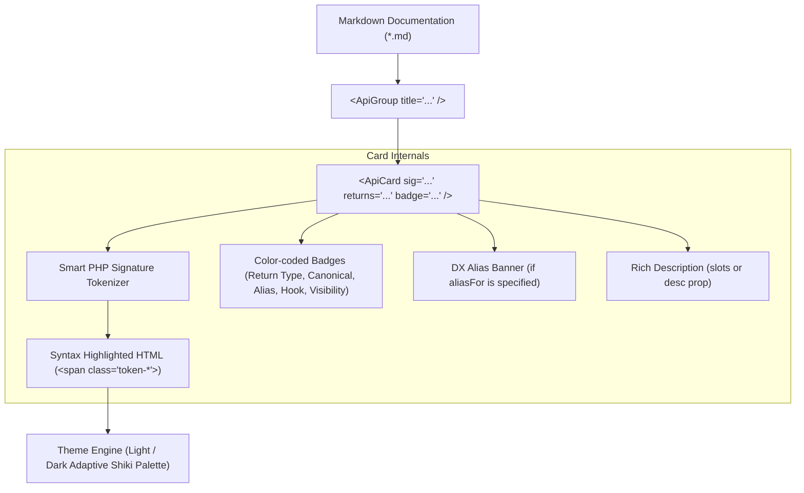

# VitePress API Catalog & Method Cards System

This skill defines the complete architecture, components, CSS tokens, and conventions for documenting classes, methods, properties, and constants across VitePress documentation suites.

---

## 💡 The Problem: Why Markdown Tables Fail for API Catalogs

Standard markdown tables (`| Method | Return Type | Description |`) are traditionally used in documentation, but suffer from fatal usability flaws when documenting rich modern PHP libraries:

1. **Horizontal Cramping & Bad Wrapping:** Long method signatures with multiple typed parameters and defaults (e.g. `useAutoMode(?PollingMode $polling, ?WebhookMode $webhook, ...)`) force awkward line wraps inside narrow table cells, breaking visual hierarchy.
2. **Monochromatic Code Text:** Plain `<code>` tags inside tables lack syntax highlighting. Parameter types, variable names, and literals all blur together in a single color.
3. **Terrible Mobile UX:** Tables force awkward horizontal scrollbars or squished columns on smaller screens.
4. **Poor Contextual Clarity:** Distinguishing aliases from canonical methods or inspecting contextual parameters is difficult in dense tables.

---

## 🏛️ Architecture: The Card-Based API Catalog

Instead of static tables, the API Catalog uses a modular, component-driven card architecture:



---

## 🧩 Components Reference

### 1. `<ApiCard>`

The primary component representing an individual method, class property, or constant.

#### Props

| Prop | Type | Default | Description |
| :--- | :--- | :--- | :--- |
| `sig` | `string` | `undefined` | The full signature to parse and tokenize (e.g. `poll(int $timeout = 30): Generator<int, Update>`). |
| `name` | `string` | `undefined` | Fallback name if no full signature is provided. |
| `returns` | `string` | `undefined` | Return type (e.g. `static`, `Generator<int, Update>`, `?int`). Automatically shown as a return badge with arrow (`→`). |
| `badge` | `string` | `undefined` | Status / category tag (e.g. `Canonical`, `Alias`, `Hook`, `Factory`, `Internal`, `Contextual`, `Asymmetric Visibility`). |
| `badgeType`| `string` | auto-detected | Override badge color style (`canonical`, `alias`, `hook`, `factory`, `internal`, `context`, `prop`, `const`). |
| `aliasFor` | `string` | `undefined` | If specified, renders an attractive callout banner indicating what canonical method this aliases. |
| `desc` | `string` | `undefined` | Short description text. Alternatively, use the default slot for rich markdown formatting. |
| `type` | `'method' \| 'property' \| 'constant'` | `'method'` | Entity type for semantic styling. |
| `example` | `string` | `undefined` | Optional code snippet demonstrating usage. |
| `deprecated`| `boolean \| string` | `false` | Marks the item as deprecated with dashed border and warning badge. |

#### Slots

- **Default Slot:** Renders the main description body. Supports inline markdown, links, codes, and paragraphs.
- `#extra`: Extra documentation elements (parameter tables, alert boxes, nested details).
- `#example`: Rich custom code block or interactive playground.

---

### 2. `<ApiGroup>`

A container component that wraps related `<ApiCard>` instances with section headings and item counters.

#### Props

| Prop | Type | Default | Description |
| :--- | :--- | :--- | :--- |
| `title` | `string` | `undefined` | Group heading title. |
| `description`| `string` | `undefined` | Subtitle explaining the architectural scope of the group. |
| `count` | `number \| string` | `undefined` | Counter badge displayed beside the title. |

---

## 🎨 Semantic Tokenizer & Theme Palette

The built-in tokenizer parses PHP signatures in real-time (both during SSR and client hydration) without any heavy external parser dependencies.

### Token Mapping Rules

| Token Class | Role in Signature | Light Mode Color | Dark Mode Color |
| :--- | :--- | :--- | :--- |
| `.token-fn` | Method / Function name | `#6f42c1` (Purple) | `#d2a8ff` (Lavender) |
| `.token-type` | Parameter / Return types (`string`, `?int`, `list<T>`) | `#0550ae` (Deep Blue) | `#79c0ff` (Sky Blue) |
| `.token-var` | Variables & arguments (`$token`, `...$handlers`) | `#b35900` (Amber) | `#ffa657` (Warm Orange) |
| `.token-val` | Literals & defaults (`= 30`, `= null`, `= false`) | `#116329` (Forest Green) | `#7ee787` (Mint Green) |
| `.token-punct` | Parentheses, commas, colons, arrows (`(`, `)`, `,`, `:`) | `#57606a` (Slate Gray) | `#8b949e` (Silver) |
| `.token-keyword` | PHP Keywords (`public`, `const`, `new`) | `#cf222e` (Crimson) | `#ff7b72` (Salmon) |
| `.token-class` | Class scope prefixes (`Telegram::`, `self::`) | `#0550ae` (Blue) | `#79c0ff` (Cyan) |
| `.token-ret` | Return type annotations (`: ConfigBuilder`) | `#0969da` (Electric Blue) | `#58a6ff` (Vibrant Blue) |
| `.token-const` | Class Constant Names (`BOT_API_VERSION`) | `#8250df` (Violet) | `#d2a8ff` (Lavender) |

---

## 📋 Standard Authoring Patterns

### 1. Documenting a Canonical Method

```html
<ApiCard
  sig="run(mixed ...$handlers)"
  returns="mixed"
  badge="Canonical"
  desc="Executes update ingestion using the configured running mode (WebhookMode or PollingMode), dispatching updates through middlewares and routes."
/>
```

### 2. Documenting an Alias with Callout Banner

```html
<ApiCard
  sig="use(callable $middleware)"
  returns="static"
  badge="Alias"
  aliasFor="middleware()"
  desc="Developer experience shorthand alias for middleware(), popularized by Telegraf and grammY."
/>
```

### 3. Documenting Complex Signatures with Unions & Defaults

```html
<ApiCard
  sig="poll(int $timeout = 30, int $limit = 100, ?array $allowedUpdates = null)"
  returns="Generator<int, Update>"
  badge="Streaming"
  desc="Returns a lazy PHP generator yielding incoming Update objects via continuous long-polling with automatic offset tracking."
/>
```

### 4. Documenting PHP 8.4 Asymmetric Visibility Properties

```html
<ApiCard
  type="property"
  sig="public private(set) ?Update $update = null"
  returns="?Update"
  badge="Asymmetric Visibility"
  desc="Current resolved Update instance for the active request lifecycle. Defaults to null until resolved by WebhookMode or PollingMode."
/>
```

### 5. Documenting Class Constants

```html
<ApiCard
  type="constant"
  sig="public const string BOT_API_VERSION = '10.3'"
  returns="string"
  badge="Constant"
  desc="Canonical Telegram Bot API version currently supported and validated against (10.3)."
/>
```

### 6. Documenting Contextual Accessors ($bot Shortcuts)

```html
<ApiCard
  sig="$bot->chatId()"
  returns="?int"
  badge="Contextual"
  desc="Resolves the active chat ID (extracted from message->chat->id, callback_query->message->chat->id, etc.)."
/>
```

### 7. Grouping Cards in a Category

```html
### 🚀 Running Modes & Resiliency

<ApiGroup description="Default bot runner selection, long-polling parameters, webhook security, and retry policies.">
  <ApiCard
    sig="withRunningMode(?RunningModeInterface $mode)"
    returns="static"
    badge="default: WebhookMode"
    desc="Configures the default bot execution runner: new WebhookMode(...), new PollingMode(...), or new AutoMode(...)."
  />
  <ApiCard
    sig="withRetryCount(int $count)"
    returns="static"
    badge="default: 3"
    desc="Number of automatic retries on rate limits (429 Too Many Requests with retry_after) or transient network dropouts."
  />
</ApiGroup>
```

---

## 🛠️ Global Registration Checklist

To equip any VitePress documentation project with this system:

1. **Place Components:**
   - `docs/.vitepress/theme/components/ApiCard.vue`
   - `docs/.vitepress/theme/components/ApiGroup.vue`
2. **Register Globally in `theme/index.ts`:**
   ```ts
   import ApiCard from './components/ApiCard.vue'
   import ApiGroup from './components/ApiGroup.vue'
   
   export default {
     extends: DefaultTheme,
     enhanceApp({ app }) {
       app.component('ApiCard', ApiCard)
       app.component('ApiGroup', ApiGroup)
     }
   }
   ```
3. **Include Styling in `custom.css`:**
   Ensure CSS variables `--api-token-*`, `.api-card`, `.api-group`, and `.api-badge` are loaded.
