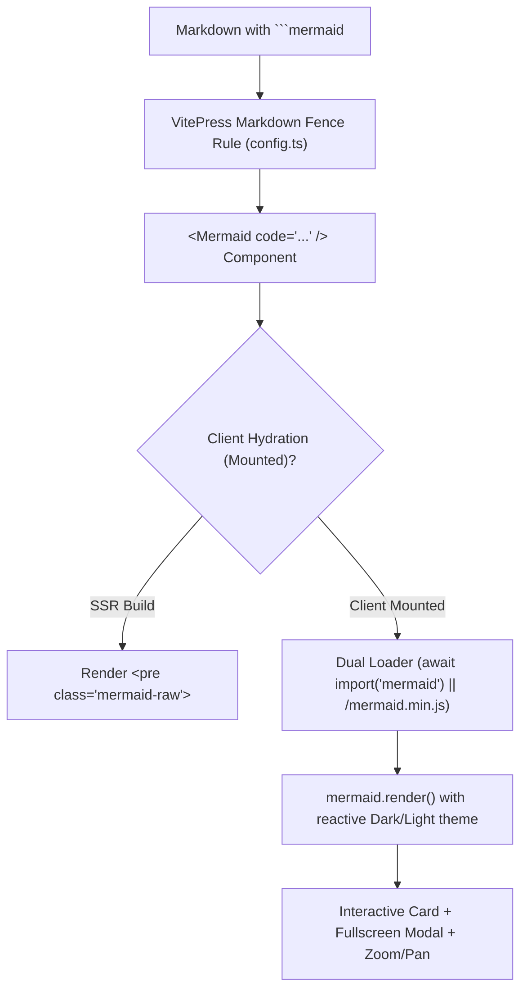
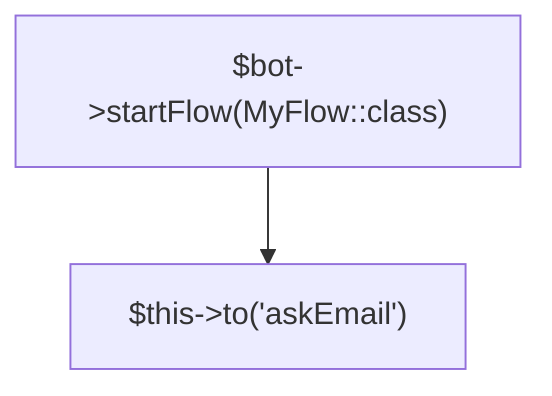
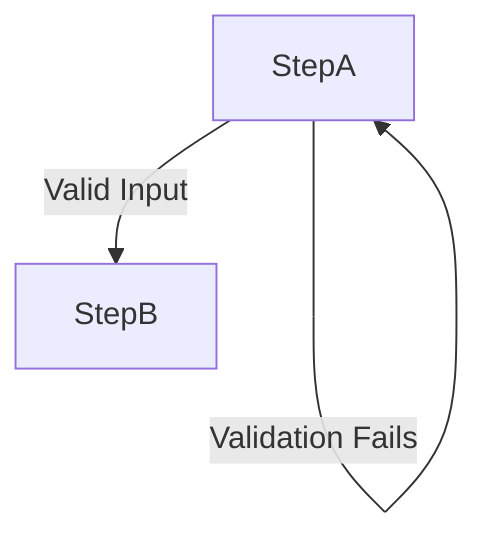
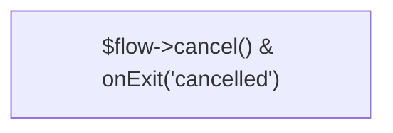

# VitePress Interactive Mermaid Integration

This skill defines the complete blueprint, architecture, components, and syntax rules for embedding rich, interactive **Mermaid Diagrams** in VitePress documentation suites.

---

## 💡 The Core Problem in VitePress

By default, VitePress does not include a Mermaid parser or component. When developers attempt to render ` ```mermaid ` code blocks:
1. **Raw Code Block Fallback:** Without a custom renderer, VitePress displays diagrams as static, unrendered code blocks.
2. **SSR (Server-Side Rendering) Crashes:** Standard Mermaid libraries rely on browser globals (`window`, `document`, `DOMPurify`, `svg`). Directly importing Mermaid during VitePress build (`vitepress build`) crashes Node.js with `ReferenceError: document is not defined` or `DOMPurify.addHook is not a function`.
3. **Mermaid Parser Failures:** Telegram / PHP method calls (`$bot->startFlow()`, `Class::method()`, `->`) break Mermaid's lexer if syntax rules (such as node quoting) are violated, causing silent rendering failures.

---

## 🏛️ Architecture: The 4-Layer Solution



1. **Markdown Fence Rule (`config.ts`):** Converts markdown fences into `<Mermaid code="${encodeURIComponent(content)}" />`.
2. **Global Component Registration (`theme/index.ts`):** Registers `Mermaid.vue` globally via `enhanceApp`.
3. **Dual-Mode Client Loader (`Mermaid.vue`):** Resolves Mermaid using Vite ESM dynamic import (`await import('mermaid')`), gracefully falling back to a static script in `public/mermaid.min.js`.
4. **Rich Interactive Modal & Controls:** Fullscreen dialog, focal mousewheel zooming, trackpad pinch, touch pan, and reset controls.

---

## 🚀 Step-by-Step Setup Guide

### 1. Install Dependencies
In your documentation root (`docs/`):

```bash
npm install -D mermaid
```

Ensure `package.json` contains:
```json
{
  "devDependencies": {
    "mermaid": "^11.x",
    "vitepress": "^1.x"
  }
}
```

And place a pre-bundled standalone fallback script in `public/mermaid.min.js` for offline/static environments.

---

### 2. Configure Markdown Fence in `.vitepress/config.ts`

Add the custom markdown rule inside `defineConfig`:

```typescript
import { defineConfig } from 'vitepress'

export default defineConfig({
  markdown: {
    config(md) {
      const defaultFence = md.renderer.rules.fence!.bind(md.renderer.rules)
      md.renderer.rules.fence = (tokens, idx, options, env, self) => {
        const token = tokens[idx]
        if (token.info.trim() === 'mermaid') {
          return `<Mermaid code="${encodeURIComponent(token.content)}" />`
        }
        return defaultFence(tokens, idx, options, env, self)
      }
    }
  },
  // ... other configs
})
```

---

### 3. Register Component in `.vitepress/theme/index.ts`

```typescript
import DefaultTheme from 'vitepress/theme'
import Mermaid from './components/Mermaid.vue'
import './custom.css'

export default {
  extends: DefaultTheme,
  enhanceApp({ app }: { app: any }) {
    app.component('Mermaid', Mermaid)
  },
}
```

---

### 4. Create the Interactive Component (`.vitepress/theme/components/Mermaid.vue`)

Create `.vitepress/theme/components/Mermaid.vue` with the following implementation:

```vue
<template>
  <div class="mermaid-wrapper">
    <!-- Inline Card -->
    <div class="mermaid-card" :class="{ 'is-loading': loading }">
      <!-- Toolbar -->
      <div v-if="svg" class="mermaid-toolbar">
        <button type="button" class="tool-btn" @click="zoomInline(-0.25)" title="Zoom Out">
          <svg viewBox="0 0 24 24" width="16" height="16" stroke="currentColor" stroke-width="2" fill="none"><circle cx="11" cy="11" r="8"></circle><line x1="21" y1="21" x2="16.65" y2="16.65"></line><line x1="8" y1="11" x2="14" y2="11"></line></svg>
        </button>
        <button type="button" class="tool-btn zoom-level" @click="resetInline" title="Reset Zoom (100%)">
          {{ Math.round(inlineScale * 100) }}%
        </button>
        <button type="button" class="tool-btn" @click="zoomInline(0.25)" title="Zoom In">
          <svg viewBox="0 0 24 24" width="16" height="16" stroke="currentColor" stroke-width="2" fill="none"><circle cx="11" cy="11" r="8"></circle><line x1="21" y1="21" x2="16.65" y2="16.65"></line><line x1="11" y1="8" x2="11" y2="14"></line><line x1="8" y1="11" x2="14" y2="11"></line></svg>
        </button>
        <div class="toolbar-divider"></div>
        <button type="button" class="tool-btn fullscreen-btn" @click="openModal" title="Open Fullscreen Auto-Fit Viewer">
          <svg viewBox="0 0 24 24" width="16" height="16" stroke="currentColor" stroke-width="2" fill="none"><path d="M8 3H5a2 2 0 0 0-2 2v3m18 0V5a2 2 0 0 0-2-2h-3m0 18h3a2 2 0 0 0 2-2v-3M3 16v3a2 2 0 0 0 2 2h3"></path></svg>
          <span class="btn-text">Fullscreen & Zoom</span>
        </button>
      </div>

      <!-- Inline Diagram Viewport -->
      <div class="mermaid-viewport" :style="inlineViewportStyle" @dblclick="openModal">
        <div
          v-if="svg"
          v-html="svg"
          ref="inlineSvgContainer"
          class="mermaid-svg-container"
          :style="{ transform: `scale(${inlineScale})`, transformOrigin: 'top center' }"
        ></div>
        <pre v-else class="mermaid-raw"><code>{{ rawCode }}</code></pre>
      </div>
    </div>

    <!-- Fullscreen Modal Interactive Viewer -->
    <Teleport to="body">
      <Transition name="fade">
        <div
          v-if="isModalOpen"
          class="mermaid-modal-backdrop"
          @click.self="closeModal"
          tabindex="0"
          ref="modalBackdrop"
        >
          <!-- Floating Controls Bar -->
          <div class="modal-controls">
            <span class="modal-zoom-badge">{{ Math.round(modalScale * 100) }}%</span>

            <button type="button" class="modal-btn" @click="zoomModalRelative(0.8)" title="Zoom Out (Scroll Down)">
              <svg viewBox="0 0 24 24" width="18" height="18" stroke="currentColor" stroke-width="2" fill="none"><circle cx="11" cy="11" r="8"></circle><line x1="21" y1="21" x2="16.65" y2="16.65"></line><line x1="8" y1="11" x2="14" y2="11"></line></svg>
            </button>

            <button type="button" class="modal-btn" @click="zoomModalRelative(1.25)" title="Zoom In (Scroll Up)">
              <svg viewBox="0 0 24 24" width="18" height="18" stroke="currentColor" stroke-width="2" fill="none"><circle cx="11" cy="11" r="8"></circle><line x1="21" y1="21" x2="16.65" y2="16.65"></line><line x1="11" y1="8" x2="11" y2="14"></line><line x1="8" y1="11" x2="14" y2="11"></line></svg>
            </button>

            <div class="modal-divider"></div>

            <button type="button" class="modal-btn text-btn" @click="fitToScreen" title="Fit to Screen (Both Width & Height)">
              <svg viewBox="0 0 24 24" width="16" height="16" stroke="currentColor" stroke-width="2" fill="none"><path d="M4 8V4m0 0h4M4 4l5 5m11-1V4m0 0h-4m4 0l-5 5M4 16v4m0 0h4m-4 0l5-5m11 5l-5-5m5 5v-4m0 4h-4"/></svg>
              <span>Fit Screen</span>
            </button>

            <button type="button" class="modal-btn text-btn" @click="fitToWidth" title="Fit to Width (Expands Diagram Width)">
              <svg viewBox="0 0 24 24" width="16" height="16" stroke="currentColor" stroke-width="2" fill="none"><path d="M21 12H3m0 0l4-4m-4 4l4 4m14-4l-4-4m4 4l-4 4"/></svg>
              <span>Fit Width</span>
            </button>

            <button type="button" class="modal-btn text-btn" @click="resetToNatural" title="100% Native Scale">
              <span>100%</span>
            </button>

            <div class="modal-divider"></div>

            <button type="button" class="modal-btn close-btn" @click="closeModal" title="Close (Esc)">
              <svg viewBox="0 0 24 24" width="20" height="20" stroke="currentColor" stroke-width="2" fill="none"><line x1="18" y1="6" x2="6" y2="18"></line><line x1="6" y1="6" x2="18" y2="18"></line></svg>
            </button>
          </div>

          <!-- Canvas with Focal Mousewheel Zoom & Drag Panning -->
          <div
            class="modal-canvas"
            :class="{ 'is-panning': isPanning }"
            @wheel.prevent="onWheel"
            @mousedown="startPan"
            @mousemove="onPan"
            @mouseup="endPan"
            @mouseleave="endPan"
            @touchstart="onTouchStart"
            @touchmove="onTouchMove"
            @touchend="onTouchEnd"
          >
            <div
              ref="modalSvgContainer"
              v-html="svg"
              class="modal-svg-wrapper"
              :style="{
                transform: `translate(${panX}px, ${panY}px) scale(${modalScale})`,
                cursor: isPanning ? 'grabbing' : 'grab'
              }"
            ></div>
          </div>

          <!-- Quick Navigation Hint -->
          <div class="modal-hint">
            <span>🖱️ Drag to Pan • ⚙️ Mouse Wheel zooms to pointer • ↔ Fit Width • ⊡ Fit Screen • Esc to Close</span>
          </div>
        </div>
      </Transition>
    </Teleport>
  </div>
</template>

<script setup>
import { ref, computed, onMounted, onUnmounted, watch, nextTick } from 'vue'
import { useData, withBase } from 'vitepress'

const props = defineProps({
  code: {
    type: String,
    required: true,
  },
})

const rawCode = decodeURIComponent(props.code)
const svg = ref('')
const loading = ref(true)
const { isDark } = useData()

const inlineSvgContainer = ref(null)
const modalSvgContainer = ref(null)
const modalBackdrop = ref(null)

// Inline view zoom
const inlineScale = ref(1)
function zoomInline(delta) {
  inlineScale.value = Math.max(0.4, Math.min(5, +(inlineScale.value + delta).toFixed(2)))
}
function resetInline() {
  inlineScale.value = 1
}

const inlineViewportStyle = computed(() => {
  return {
    overflow: 'auto',
    maxHeight: inlineScale.value > 1.1 ? '80vh' : 'none',
  }
})

// Modal View Zoom & Pan
const isModalOpen = ref(false)
const modalScale = ref(1)
const panX = ref(0)
const panY = ref(0)
const isPanning = ref(false)
const startMouseX = ref(0)
const startMouseY = ref(0)

function getNaturalDimensions() {
  if (svg.value) {
    const match = svg.value.match(/viewBox=["']([^"']+)["']/i)
    if (match && match[1]) {
      const parts = match[1].trim().split(/[\s,]+/).map(Number)
      if (parts.length === 4 && parts[2] > 0 && parts[3] > 0) {
        return { width: parts[2], height: parts[3] }
      }
    }
  }

  const container = modalSvgContainer.value || inlineSvgContainer.value
  const svgEl = container?.querySelector('svg')
  if (svgEl) {
    const vb = svgEl.viewBox?.baseVal
    if (vb && vb.width > 0 && vb.height > 0) {
      return { width: vb.width, height: vb.height }
    }
    const rect = svgEl.getBoundingClientRect()
    if (rect.width > 0 && rect.height > 0) {
      return { width: rect.width, height: rect.height }
    }
  }

  return { width: 900, height: 600 }
}

function calculateFitScale(target = 'both') {
  const { width: svgW, height: svgH } = getNaturalDimensions()
  const marginX = 80
  const marginY = 110
  const availW = Math.max(250, window.innerWidth - marginX)
  const availH = Math.max(250, window.innerHeight - marginY)

  const scaleX = availW / svgW
  const scaleY = availH / svgH

  if (target === 'width') {
    return Math.min(scaleX, 4.0)
  }

  let fitScale = Math.min(scaleX, scaleY)
  if (svgW <= availW && svgH <= availH) {
    fitScale = 1.0
  }

  return Math.max(0.1, Math.min(20, +fitScale.toFixed(3)))
}

function applySvgExplicitDimensions() {
  const { width: svgW, height: svgH } = getNaturalDimensions()
  const modalSvg = modalSvgContainer.value?.querySelector('svg')
  if (modalSvg) {
    modalSvg.style.width = `${svgW}px`
    modalSvg.style.height = `${svgH}px`
  }
}

function openModal() {
  isModalOpen.value = true
  document.body.style.overflow = 'hidden'

  nextTick(() => {
    modalBackdrop.value?.focus()
    applySvgExplicitDimensions()
    modalScale.value = calculateFitScale('both')
    panX.value = 0
    panY.value = 0
  })
}

function closeModal() {
  isModalOpen.value = false
  document.body.style.overflow = ''
}

function fitToScreen() {
  applySvgExplicitDimensions()
  modalScale.value = calculateFitScale('both')
  panX.value = 0
  panY.value = 0
}

function fitToWidth() {
  applySvgExplicitDimensions()
  modalScale.value = calculateFitScale('width')
  panX.value = 0

  const { height: svgH } = getNaturalDimensions()
  const scaledH = svgH * modalScale.value
  const winH = window.innerHeight
  if (scaledH > winH) {
    panY.value = (scaledH - winH) / 2 - 60
  } else {
    panY.value = 0
  }
}

function resetToNatural() {
  applySvgExplicitDimensions()
  modalScale.value = 1.0
  panX.value = 0
  panY.value = 0
}

function zoomModalRelative(factor) {
  modalScale.value = Math.max(0.05, Math.min(20, +(modalScale.value * factor).toFixed(3)))
}

function onWheel(e) {
  const factor = e.deltaY < 0 ? 1.25 : 0.8
  const newScale = Math.max(0.05, Math.min(20, +(modalScale.value * factor).toFixed(3)))
  if (newScale === modalScale.value) return

  const mouseX = e.clientX - window.innerWidth / 2
  const mouseY = e.clientY - window.innerHeight / 2
  const ratio = newScale / modalScale.value

  panX.value = mouseX - (mouseX - panX.value) * ratio
  panY.value = mouseY - (mouseY - panY.value) * ratio
  modalScale.value = newScale
}

function startPan(e) {
  if (e.button !== 0) return
  isPanning.value = true
  startMouseX.value = e.clientX - panX.value
  startMouseY.value = e.clientY - panY.value
}

function onPan(e) {
  if (!isPanning.value) return
  panX.value = e.clientX - startMouseX.value
  panY.value = e.clientY - startMouseY.value
}

function endPan() {
  isPanning.value = false
}

let initialTouchDist = 0
let initialTouchScale = 1
function onTouchStart(e) {
  if (e.touches.length === 1) {
    isPanning.value = true
    startMouseX.value = e.touches[0].clientX - panX.value
    startMouseY.value = e.touches[0].clientY - panY.value
  } else if (e.touches.length === 2) {
    isPanning.value = false
    initialTouchDist = Math.hypot(
      e.touches[0].clientX - e.touches[1].clientX,
      e.touches[0].clientY - e.touches[1].clientY
    )
    initialTouchScale = modalScale.value
  }
}

function onTouchMove(e) {
  if (e.touches.length === 1 && isPanning.value) {
    panX.value = e.touches[0].clientX - startMouseX.value
    panY.value = e.touches[0].clientY - startMouseY.value
  } else if (e.touches.length === 2 && initialTouchDist > 0) {
    const dist = Math.hypot(
      e.touches[0].clientX - e.touches[1].clientX,
      e.touches[0].clientY - e.touches[1].clientY
    )
    const factor = dist / initialTouchDist
    modalScale.value = Math.max(0.05, Math.min(20, +(initialTouchScale * factor).toFixed(3)))
  }
}

function onTouchEnd() {
  isPanning.value = false
  initialTouchDist = 0
}

function handleKeydown(e) {
  if (!isModalOpen.value) return
  if (e.key === 'Escape') closeModal()
  else if (e.key === '+' || e.key === '=') zoomModalRelative(1.25)
  else if (e.key === '-' || e.key === '_') zoomModalRelative(0.8)
  else if (e.key === '0') resetToNatural()
  else if (e.key === 'w' || e.key === 'W') fitToWidth()
  else if (e.key === 'f' || e.key === 'F') fitToScreen()
}

// Dual-Mode Script Loader
async function getMermaid() {
  if (typeof window === 'undefined') return Promise.reject(new Error('SSR'))
  if (window.mermaid) return window.mermaid

  if (!window._mermaidLoadPromise) {
    window._mermaidLoadPromise = (async () => {
      // 1. Try dynamic ESM import (pre-bundled by Vite)
      try {
        const mod = await import('mermaid')
        const instance = mod?.default ?? mod
        if (instance && (typeof instance.render === 'function' || typeof instance.initialize === 'function')) {
          window.mermaid = instance
          return instance
        }
      } catch (e) {
        // Fallback to static script
      }

      // 2. Fallback to /mermaid.min.js in public/
      return new Promise((resolve, reject) => {
        const scriptUrl = withBase('/mermaid.min.js')
        const existing = document.querySelector(`script[src="${scriptUrl}"]`)
        if (existing) {
          if (window.mermaid) {
            resolve(window.mermaid)
          } else {
            existing.addEventListener('load', () => resolve(window.mermaid))
            existing.addEventListener('error', (err) => reject(err))
          }
          return
        }

        const script = document.createElement('script')
        script.src = scriptUrl
        script.onload = () => {
          if (window.mermaid) {
            resolve(window.mermaid)
          } else {
            reject(new Error('Mermaid script loaded but window.mermaid undefined'))
          }
        }
        script.onerror = (err) => reject(err)
        document.head.appendChild(script)
      })
    })()
  }

  return window._mermaidLoadPromise
}

async function renderDiagram() {
  if (typeof window === 'undefined') return
  try {
    loading.value = true
    const mermaid = await getMermaid()
    mermaid.initialize({
      startOnLoad: false,
      securityLevel: 'loose',
      theme: isDark.value ? 'dark' : 'default',
    })
    const id = `mermaid-${Math.random().toString(36).substring(2, 9)}`
    const { svg: renderedSvg } = await mermaid.render(id, rawCode)
    svg.value = renderedSvg
  } catch (err) {
    console.error('Mermaid rendering failed:', err)
  } finally {
    loading.value = false
  }
}

onMounted(() => {
  renderDiagram()
  window.addEventListener('keydown', handleKeydown)
})

onUnmounted(() => {
  window.removeEventListener('keydown', handleKeydown)
  document.body.style.overflow = ''
})

watch(isDark, () => {
  renderDiagram()
})
</script>

<style scoped>
.mermaid-wrapper {
  margin: 1.75rem 0;
  position: relative;
}

.mermaid-card {
  position: relative;
  background-color: var(--vp-c-bg-soft);
  border-radius: 12px;
  border: 1px solid var(--vp-c-divider);
  transition: border-color 0.25s, box-shadow 0.25s;
  overflow: hidden;
}

.mermaid-card:hover {
  border-color: var(--vp-c-brand-1);
}

.mermaid-toolbar {
  display: flex;
  align-items: center;
  justify-content: flex-end;
  gap: 4px;
  padding: 8px 12px;
  background: var(--vp-c-bg-mute);
  border-bottom: 1px solid var(--vp-c-divider);
}

.tool-btn {
  display: inline-flex;
  align-items: center;
  justify-content: center;
  padding: 4px 8px;
  height: 28px;
  border-radius: 6px;
  border: 1px solid transparent;
  background: transparent;
  color: var(--vp-c-text-2);
  font-size: 12px;
  font-weight: 500;
  cursor: pointer;
  transition: all 0.2s;
}

.tool-btn:hover {
  background: var(--vp-c-bg-soft);
  color: var(--vp-c-text-1);
  border-color: var(--vp-c-divider);
}

.tool-btn.zoom-level {
  min-width: 48px;
  font-family: monospace;
}

.toolbar-divider {
  width: 1px;
  height: 16px;
  background-color: var(--vp-c-divider);
  margin: 0 4px;
}

.fullscreen-btn {
  gap: 6px;
  color: var(--vp-c-brand-1);
  font-weight: 600;
}

.fullscreen-btn:hover {
  background: var(--vp-c-brand-soft);
  color: var(--vp-c-brand-1);
}

.mermaid-viewport {
  padding: 1.5rem;
  display: flex;
  justify-content: center;
  align-items: center;
  cursor: zoom-in;
}

.mermaid-svg-container {
  display: flex;
  justify-content: center;
  transition: transform 0.2s ease-out;
  max-width: 100%;
}

.mermaid-svg-container :deep(svg) {
  max-width: 100%;
  height: auto;
}

.mermaid-raw {
  margin: 0 !important;
  padding: 0 !important;
  background: transparent !important;
  font-size: 0.85em;
  color: var(--vp-c-text-2);
}

/* Modal Overlay */
.mermaid-modal-backdrop {
  position: fixed;
  inset: 0;
  z-index: 99999;
  background-color: rgba(0, 0, 0, 0.82);
  backdrop-filter: blur(12px);
  display: flex;
  flex-direction: column;
  overflow: hidden;
  user-select: none;
  outline: none;
}

.modal-controls {
  position: absolute;
  top: 18px;
  right: 24px;
  z-index: 10;
  display: flex;
  align-items: center;
  gap: 6px;
  background: var(--vp-c-bg);
  padding: 6px 14px;
  border-radius: 30px;
  box-shadow: 0 8px 32px rgba(0, 0, 0, 0.4);
  border: 1px solid var(--vp-c-divider);
}

.modal-zoom-badge {
  font-size: 13px;
  font-family: monospace;
  font-weight: 700;
  color: var(--vp-c-brand-1);
  padding: 0 6px;
  min-width: 52px;
  text-align: center;
}

.modal-btn {
  display: inline-flex;
  align-items: center;
  justify-content: center;
  height: 32px;
  border-radius: 6px;
  background: var(--vp-c-bg-soft);
  border: 1px solid var(--vp-c-divider);
  color: var(--vp-c-text-1);
  cursor: pointer;
  transition: all 0.2s;
  padding: 0 8px;
  font-size: 12px;
  font-weight: 500;
  gap: 6px;
}

.modal-btn:hover {
  background: var(--vp-c-brand-1);
  color: #fff;
  border-color: var(--vp-c-brand-1);
  transform: translateY(-1px);
}

.modal-btn.close-btn {
  width: 32px;
  padding: 0;
  border-radius: 50%;
}

.modal-btn.close-btn:hover {
  background: #ef4444;
  border-color: #ef4444;
  color: #fff;
}

.modal-divider {
  width: 1px;
  height: 18px;
  background-color: var(--vp-c-divider);
  margin: 0 3px;
}

.modal-canvas {
  flex: 1;
  width: 100vw;
  height: 100vh;
  display: flex;
  justify-content: center;
  align-items: center;
  overflow: hidden;
  touch-action: none;
}

.modal-svg-wrapper {
  transform-origin: center center;
  display: flex;
  justify-content: center;
  align-items: center;
  will-change: transform;
}

.modal-svg-wrapper :deep(svg) {
  max-width: none !important;
  max-height: none !important;
  display: block;
  filter: drop-shadow(0 12px 36px rgba(0, 0, 0, 0.35));
}

.modal-hint {
  position: absolute;
  bottom: 20px;
  left: 50%;
  transform: translateX(-50%);
  background: rgba(0, 0, 0, 0.7);
  border: 1px solid rgba(255, 255, 255, 0.15);
  color: #fff;
  font-size: 12px;
  padding: 6px 18px;
  border-radius: 20px;
  pointer-events: none;
  letter-spacing: 0.3px;
  box-shadow: 0 4px 16px rgba(0, 0, 0, 0.3);
}

.fade-enter-active,
.fade-leave-active {
  transition: opacity 0.25s ease;
}

.fade-enter-from,
.fade-leave-to {
  opacity: 0;
}
</style>
```

---

## 📐 Golden Syntax Rules for Mermaid in Docs

When documenting code, methods, classes, and workflows, **always follow these 4 syntax rules** to prevent Mermaid parser crashes:

### Rule 1: Always Prefer `graph TD` / `graph LR` over `stateDiagram-v2`
`stateDiagram-v2` treats words followed by colons or arrows as transition definitions, causing syntax collisions with PHP namespace separators (`\`), static calls (`::`), and method arrows (`->`). `graph TD` is much more resilient.

### Rule 2: Always Quote Node Labels
Whenever a label contains special characters (`->`, `()`, `::`, `[]`, `{}`, quotes, spaces), wrap the label inside double quotes:



### Rule 3: Use Pipe Notation for Transition Labels
Use `-->|Condition|` instead of trailing colons:



### Rule 4: Escape HTML Entities
Use `&amp;` instead of raw `&` inside labels:



---

## 🧪 Verification Checklist

1. **Verify Static Build:**
   ```bash
   npm run docs:build
   ```
   Ensure build exits with code 0 without SSR `document is not defined` errors.
2. **Verify Interactive Features in Dev:**
   ```bash
   npm run docs:dev
   ```
   - Double click any diagram to open fullscreen modal.
   - Test mousewheel zoom, drag-to-pan, and keyboard shortcuts (`Esc`, `+`, `-`, `0`, `w`, `f`).
   - Toggle dark/light theme to verify real-time SVG re-rendering.
