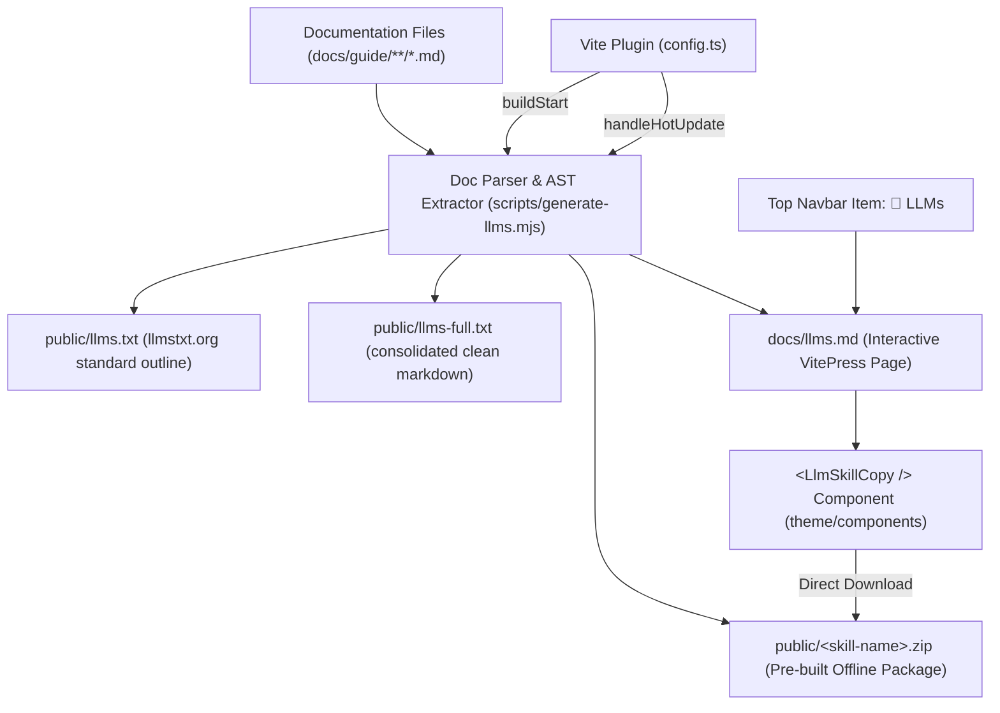

# VitePress LLM Integration & Automated Documentation Map Skill

This skill defines the complete architecture, blueprint, and automation patterns for integrating **LLM Context Hubs**, **`llms.txt` specifications**, and **Downloadable AI Agent Skill Packages (.zip)** into any VitePress documentation site.

---

## 💡 The Core Problem in Modern Documentation

Traditional documentation sites are built exclusively for human visual browsing:
1. **Context Fragmentation:** Information is split across dozens of nested pages, forcing AI models (Claude, ChatGPT, Cursor, Copilot, Antigravity) to make numerous HTTP requests or crawl shallow links.
2. **UI & DOM Noise:** HTML elements, navigation wrappers, carousels, and client-side web components pollute LLM context windows and induce hallucinations.
3. **Lack of Coding Directives:** LLMs need to know language versions (e.g. PHP 8.4+, strict types, property hooks) and architectural constraints upfront before writing a single line of code.
4. **Desynchronization Risk:** Static prompt guides quickly become stale as new features and markdown files are added.
5. **No Easy Offline Skill Export:** Developers using Claude Desktop, Cursor, or local agent runners want a self-contained skill folder (`<skill-name>/SKILL.md` + `docs/`) that they can drop directly into their agents or projects.

---

## 🏛️ Architecture: The Automated LLM Pipeline



The system produces **four synchronized outputs** automatically whenever documentation files are created or modified:

| Output | Path | Target Audience | Purpose |
| :--- | :--- | :--- | :--- |
| **Downloadable Skill ZIP** | `public/<skill-name>.zip` | Claude Desktop, Cursor, Antigravity, Cline | Self-contained agent skill folder (`<skill-name>/`) with root `SKILL.md` and complete offline `docs/` folder. |
| **Standard LLM Outline** | `public/llms.txt` | Cursor, Perplexity, Web Crawlers | Adheres to [llmstxt.org](https://llmstxt.org) standard; contains project identity, core rules, and deep link map with subheadings. |
| **Consolidated Context** | `public/llms-full.txt` | Claude Projects, Gemini Context, DeepSeek | All guides concatenated into a single, clean markdown document stripped of UI noise. |
| **Interactive LLM Hub** | `docs/llms.md` (`/llms`) | Human Developers & AI Agents | Web page with 1-click download button, prompt copy, URLs, and a browsable doc map. |

---

## 📦 Why Pre-building the ZIP Archive is Superior

When offering a downloadable skill ZIP in a documentation site:
1. **100% Static & CDN-Friendly:** Generates during `buildStart` directly into `docs/public/`. It works seamlessly on GitHub Pages, Cloudflare Pages, Netlify, and Nginx with zero backend server.
2. **Instant Download:** Clicking the download button initiates an immediate HTTP download without any client-side browser freezing or runtime JSZip CPU latency.
3. **CLI-Curlable:** Developers and automated CI/CD pipelines can fetch the skill archive directly:
   ```bash
   curl -O https://example.com/tueen-telegram-bot-api-sdk.zip
   unzip tueen-telegram-bot-api-sdk.zip -d .agents/skills/
   ```
4. **Always Synchronized:** Vite's `handleHotUpdate` and VitePress's `buildStart` automatically regenerate the ZIP file whenever any markdown file changes.

---

## 🚀 Step-by-Step Implementation Guide

### 1. Install JSZip in Documentation Root
```bash
cd docs
npm install -D jszip
```

### 2. Document Extraction & Generation Script (`scripts/generate-llms.mjs`)

The generator traverses documentation files, extracts H1 titles, H2/H3 subheadings, slugifies anchor links, bundles the offline ZIP package, and updates the public text files.

```javascript
import fs from 'node:fs'
import path from 'node:path'
import { fileURLToPath } from 'node:url'
import JSZip from 'jszip'

const __dirname = path.dirname(fileURLToPath(import.meta.url))
const docsDir = path.resolve(__dirname, '..')
const guideDir = path.resolve(docsDir, 'guide')
const publicDir = path.resolve(docsDir, 'public')
const zipOutputFile = path.resolve(publicDir, 'tueen-telegram-bot-api-sdk.zip')

export async function generateLlms() {
  fs.mkdirSync(publicDir, { recursive: true })
  
  // 1. Parse markdown files and build table of contents
  const parsedSections = parseAllDocs()

  // 2. Generate standalone SKILL.md
  const skillContent = generateSkillMarkdown(parsedSections)

  // 3. Assemble the ZIP package
  const zip = new JSZip()
  const zipRoot = zip.folder('tueen-telegram-bot-api-sdk')
  zipRoot.file('SKILL.md', skillContent)

  const zipDocs = zipRoot.folder('docs')
  for (const item of allDocs) {
    zipDocs.file(item.relativePath, item.cleanedMarkdown)
  }

  const zipBuffer = await zip.generateAsync({
    type: 'nodebuffer',
    compression: 'DEFLATE',
    compressionOptions: { level: 9 }
  })

  // Safe write (only write if contents actually changed)
  safeWriteBuffer(zipOutputFile, zipBuffer)
}
```

---

### 3. VitePress Configuration & Vite Plugin Hook (`docs/.vitepress/config.ts`)

Hook the generator into VitePress's build and development lifecycle:

```typescript
import { generateLlms, getCanonicalSiteUrl } from '../scripts/generate-llms.mjs'

function llmsPlugin() {
  return {
    name: 'vitepress-llms-generator',
    async buildStart() {
      // Runs automatically before dev server starts or build begins
      await generateLlms()
    },
    async handleHotUpdate({ file }: { file: string }) {
      // Re-run when any markdown file changes (except llms.md to avoid infinite loops)
      if (file.endsWith('.md') && !file.endsWith('llms.md')) {
        await generateLlms()
      }
    },
    configureServer(server: any) {
      // Dynamically rewrites links in /llms.txt during local development (localhost / 127.0.0.1)
      server.middlewares.use((req: any, res: any, next: any) => {
        const url = req.url?.split('?')[0]
        if (url === '/llms.txt' || url === '/llms-full.txt') {
          const currentOrigin = `http://${req.headers.host || 'localhost:5173'}`
          const filePath = path.resolve(publicDir, url.slice(1))
          if (fs.existsSync(filePath)) {
            const content = fs.readFileSync(filePath, 'utf-8')
            res.setHeader('Content-Type', 'text/plain; charset=utf-8')
            res.end(content.replaceAll(getCanonicalSiteUrl(), currentOrigin))
            return
          }
        }
        next()
      })
    }
  }
}

export default defineConfig({
  vite: {
    plugins: [llmsPlugin()]
  },
  themeConfig: {
    nav: [
      { text: 'Home', link: '/' },
      { text: 'Guide', link: '/guide/getting-started' },
      { text: '🤖 LLMs', link: '/llms' }, // Top navbar entry point
      // ...
    ]
  }
})
```

---

### 4. Interactive UI Component (`docs/.vitepress/theme/components/LlmSkillCopy.vue`)

Provide developers with one-click actions:

- **📦 Download Skill (.zip):** Direct link to `tueen-telegram-bot-api-sdk.zip` containing `SKILL.md` + `docs/`.
- **📋 Copy AI Agent Skill:** Formats a ready-to-paste system prompt.
- **🔗 Copy llms.txt URL:** Copies the absolute URL to `/llms.txt`.
- **📚 Copy llms-full.txt URL:** Copies the link to the concatenated context file.
- **↗ Open Raw:** Direct link to inspect the plain text version.

Register the component globally in `docs/.vitepress/theme/index.ts`:

```typescript
import DefaultTheme from 'vitepress/theme'
import LlmSkillCopy from './components/LlmSkillCopy.vue'

export default {
  extends: DefaultTheme,
  enhanceApp({ app }) {
    app.component('LlmSkillCopy', LlmSkillCopy)
  }
}
```

---

## 🛡️ Critical Guidelines & Safeguards

1. **Infinite Rebuild Prevention (`safeWrite` & File Ignore):**
   Generating `docs/llms.md` during development triggers Vite's file watcher.
   - Always ignore `llms.md` in `handleHotUpdate` (`!file.endsWith('llms.md')`).
   - Use `safeWrite()` and `safeWriteBuffer()` to compare buffers before writing to disk.
2. **Standard Internal Structure of the ZIP:**
   The ZIP archive must extract to a single named root folder (`<skill-name>/`):
   ```
   tueen-telegram-bot-api-sdk/
   ├── SKILL.md       # Root skill entry point with YAML frontmatter
   └── docs/          # Nested docs preserving paths matching SKILL.md links
   ```
   This allows users to unzip directly into `.agents/skills/` without files scattering into the root directory.
3. **Anchor Slugification Compatibility:**
   VitePress converts headers to lowercase and strips special characters (`!`, `@`, `#`, `?`, etc.). The generator must replicate this so links like `[Client Initialization](/guide/getting-started#client-initialization)` resolve directly to the DOM anchor.
4. **Top Navbar Accessibility:**
   The `🤖 LLMs` nav item ensures both AI scrapers and developers can discover the machine-readable context and skill download immediately upon visiting the documentation root.
