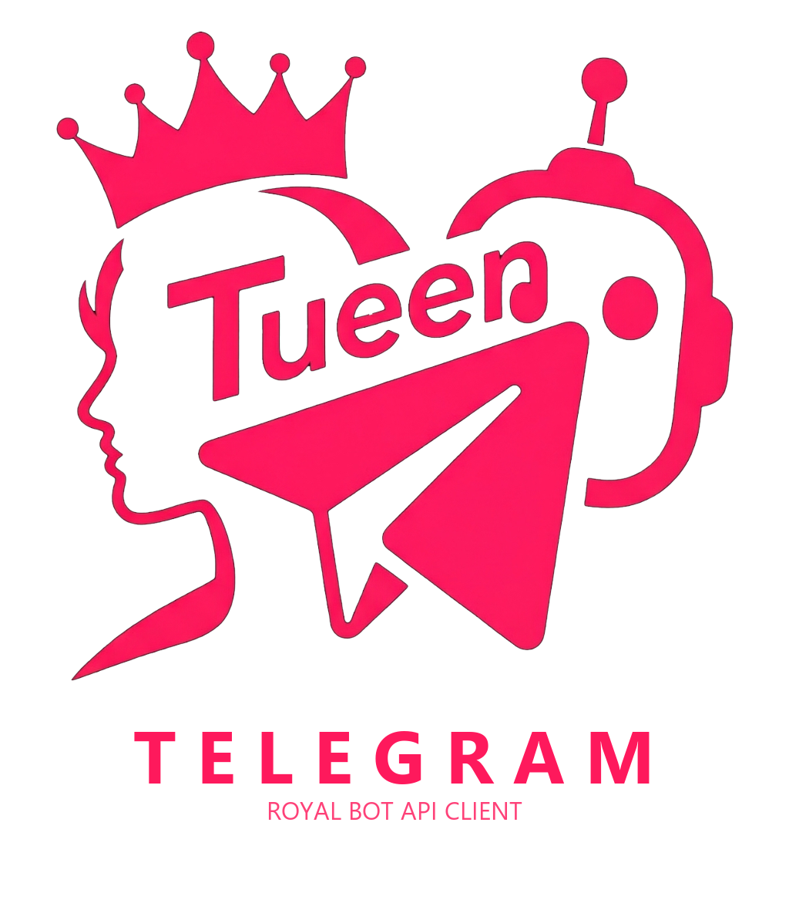

<p align="center">
  <a href="https://github.com/tueen/telegram">
    
  </a>
</p>

<h1 align="center">Tueen Telegram 👑</h1>

<p align="center">
  <strong>The Royal Telegram Bot SDK for Modern PHP</strong><br>
  <em>Part of the Tueen ecosystem — "The Queen of Telegram"</em>
</p>

<p align="center">
  <a href="https://php.net"></a>
  <a href="LICENSE"></a>
  <a href="https://core.telegram.org/bots/api"></a>
</p>

---

`tueen/telegram` is a high-performance, strictly-typed Telegram Bot SDK crafted for modern PHP (8.4+). Built with zero legacy overhead, it pairs complete Bot API coverage with declarative attribute routing, stateful conversation flows, an embedded real-time web dashboard, and royal developer ergonomics.

---

## ⚡ Highlights

- 🚀 **Zero-Config App & Web Dashboard:** Instant boot with `App::run()`, CLI toolkit, and a live web UI for webhook inspection and bot health.
- 👑 **Complete Coverage:** All Telegram Bot API methods and types with 100% strict typing.
- 💎 **Modern PHP Architecture:** Property hooks, asymmetric visibility (`private(set)`), pipe operator support, and typed enums.
- 🧭 **Attribute Routing:** Declarative update routing with `#[OnCommand]`, `#[OnCallbackQuery]`, regex matchers, and controllers.
- 💬 **Conversation Flows:** Stateful multi-step user dialogues (`to()`, `stay()`, `back()`, `finish()`) with pluggable state stores.
- 🔄 **Adaptive Running Modes:** Seamlessly switch between `WebhookMode` (with secret token & `safeResponse`), `PollingMode`, and `AutoMode`.
- ⌨️ **Fluent Keyboards & Formatting:** Intuitive Inline/Reply keyboard builders and Telegram-compliant HTML/MarkdownV2 builders.
- 🔌 **Resilient Pipeline:** Extensible onion middleware featuring automatic 429 flood-wait pacing, retries, and PSR-3 logging.
- 🎯 **Smart Helpers & Context:** Dynamic fallback, camelCase/ArrayAccess property access, and auto-resolved chat/user context IDs.
- 🛡️ **Dual Error Modes & ok():** Universal `ok()` checks across all models. Choose between standard exceptions or typed `Error` objects.
- 🧪 **In-Memory Testing:** Test bots with zero HTTP calls using `TelegramFake`, stub responses, and expressive assertions (`assertSent`).

---

## 📦 Requirements & Installation

- **PHP 8.4+** (with full PHP 8.5+ support)
- Composer 2.x

```bash
composer require tueen/telegram
```

---

## 📖 Documentation

All detailed guides, real-world examples, configuration options, and running modes are available in our official documentation:

👉 **[Explore Full Documentation](./docs)**

To run the interactive docs locally:

```bash
cd docs
npm install
npm run docs:dev
```

---

## 📜 License

Licensed under the [MIT License](LICENSE.md).
