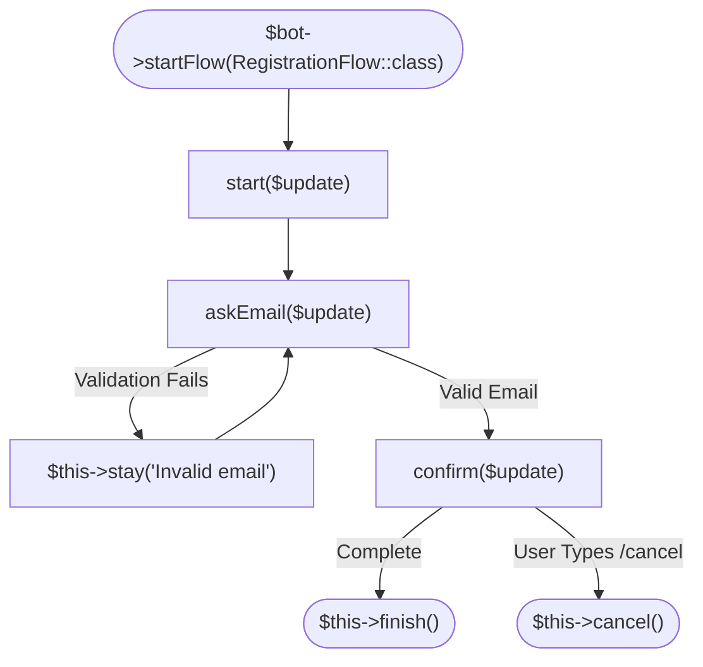

# Conversational Flows (Linear Forms)

The base `Tueen\Telegram\Flow\Flow` class provides a linear state machine for multi-step textual dialogues, surveys, registration forms, and multi-prompt wizards.



---

## 🏛️ Anatomy of a Conversational Flow

Every step in a `Flow` is a public method that receives the incoming Telegram `Update`:

```php
namespace App\Flows;

use Tueen\Telegram\Flow\Flow;
use Tueen\Telegram\Types\Update;

class RegistrationFlow extends Flow
{
    public function start(Update $update): void
    {
        $this->bot->sendMessage(chatId: $this->chatId, text: 'Welcome! What is your full name?');
        $this->to('askEmail');
    }

    public function askEmail(Update $update): void
    {
        $name = trim($update->findAnyText() ?? '');

        if (strlen($name) < 2) {
            $this->stay('Name must be at least 2 characters. Please try again:');
            return;
        }

        $this->set('name', $name);
        $this->bot->sendMessage(chatId: $this->chatId, text: "Nice to meet you, {$name}! What is your email?");
        $this->to('confirm');
    }

    public function confirm(Update $update): void
    {
        $email = trim($update->findAnyText() ?? '');

        if (!filter_var($email, FILTER_VALIDATE_EMAIL)) {
            $this->stay('Invalid email format. Please enter a valid email:');
            return;
        }

        $this->set('email', $email);
        $name = $this->get('name');

        $this->bot->sendMessage(
            chatId: $this->chatId,
            text: "✅ Registration complete for {$name} ({$email})!"
        );

        $this->finish();
    }
}
```

---

## 🧭 Step Navigation Methods

### `$this->to(string $stepMethod, array $data = []): static`
Moves the user to the specified step method on their next incoming update.
- Records the previous step in `$state->history` for back-navigation.
- Merges optional key-value `$data` into session storage.
- Automatically saves state and refreshes session TTL.

### `$this->stay(?string $replyMessage = null, mixed $keyboard = null): static`
Retains the user on the current step without appending to history.
- Sends an optional validation error prompt.
- Optionally displays a keyboard.

### `$this->back(?string $replyMessage = null): static`
Navigates to the previous step in history, or completes the flow if history is empty.

### `$this->finish(): void`
Completes the flow, removes session state from storage, and executes `onExit($update, 'finished')`.

### `$this->cancel(?string $replyMessage = 'Operation cancelled.'): void`
Cancels the flow, purges stored state, sends the optional cancellation message, and triggers `onExit($update, 'cancelled')`.
