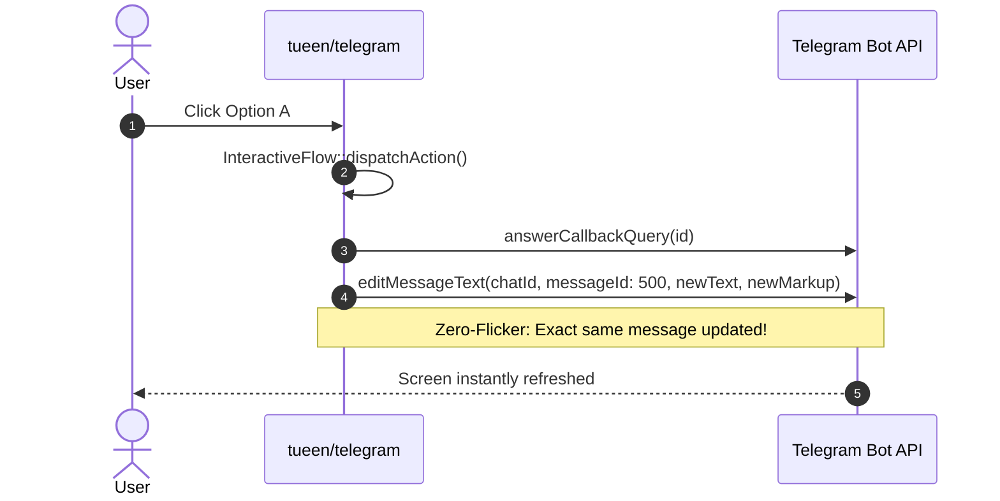

# Interactive Screens & Zero-Flicker Transitions

While standard `Flow` classes handle linear textual forms, **`InteractiveFlow`** is built for rich, menu-driven bots, dashboards, e-commerce product catalogs, and interactive control panels.

---

## ⚡ Zero-Flicker In-Place Editing

Unlike other frameworks that repeatedly delete and resend messages—causing visible UI flickering and consuming redundant Telegram API calls—`InteractiveFlow` automatically tracks the active message ID (`$this->messageId`) and updates messages in-place using `editMessageText` and `editMessageReplyMarkup`.



### Automatic Fallback Recovery
If in-place editing is not possible (e.g. the message was deleted by the user, the 48-hour Telegram edit window elapsed, or the screen switched from an inline keyboard to a native reply keyboard), `InteractiveFlow` gracefully falls back to sending a new message with `sendMessage`, automatically updating `$this->messageId`.

---

## 🖥️ The `Screen` Builder

The `Screen` object defines the content, formatting, keyboard markup, and navigation options for the active step:

```php
use Tueen\Telegram\Enums\ParseMode;
use Tueen\Telegram\Flow\Screen;
use Tueen\Telegram\Keyboards\InlineKeyboard;

public function render(): Screen
{
    return Screen::make("📦 *Product Catalog*\n\nChoose an item below:")
        ->parseMode(ParseMode::MARKDOWN_V2)
        ->inline(fn (InlineKeyboard $k) => $k
            ->row()
                ->action('Item 1 ($10)', 'item_1')
                ->action('Item 2 ($20)', 'item_2')
            ->row()
                ->url('Official Store', 'https://example.com')
        )
        ->withNavigation(back: true, home: true);
}
```

### Screen Builder Methods

<ApiGroup description="Methods on the Screen builder for constructing zero-flicker conversational displays.">
  <ApiCard
    sig="text(string $text): static"
    returns="static"
    badge="Content"
    desc="Sets the message body text."
  />
  <ApiCard
    sig="parseMode(ParseMode|string $mode): static"
    returns="static"
    badge="Formatting"
    desc="Sets HTML or MarkdownV2 formatting mode."
  />
  <ApiCard
    sig="inline(callable|InlineKeyboard $keyboard): static"
    returns="static"
    badge="Keyboard"
    desc="Attaches an inline keyboard with callback actions."
  />
  <ApiCard
    sig="reply(callable|ReplyKeyboard $keyboard): static"
    returns="static"
    badge="Keyboard"
    desc="Switches to native Telegram reply keyboard buttons."
  />
  <ApiCard
    sig="removeKeyboard(bool $selective = false): static"
    returns="static"
    badge="Keyboard"
    desc="Dispatches a ReplyKeyboardRemove markup."
  />
  <ApiCard
    sig="withNavigation(bool $back = true, bool $home = true): static"
    returns="static"
    badge="Navigation"
    desc="Appends language-neutral navigation buttons (🔙 Back, 🏠 Home)."
  />
  <ApiCard
    sig="editIfPossible(bool $edit = true): static"
    returns="static"
    badge="Modifier"
    desc="Enables or disables in-place message editing."
  />
</ApiGroup>

---

## 🔄 Refreshing Screens In-Place

To re-render the screen when state changes (e.g., toggling a switch or updating a counter), call `$this->refresh()`:

```php
#[Action('toggle_notify')]
public function toggleNotify(): void
{
    $current = $this->get('notify', true);
    $this->set('notify', !$current);
    
    // Immediately re-renders the screen in-place with updated state
    $this->refresh();
}
```

---

## 🔔 Native Telegram Alerts & Toasts

Instead of updating the screen text, you can display native Telegram popups in response to button clicks:

```php
#[Action('like')]
public function handleLike(): void
{
    $this->likes++;
    
    // Shows a subtle toast notification at the bottom of the user's screen:
    $this->toast('❤️ Added to favorites!');

    // Or show a modal dialog box with an OK button:
    // $this->alert('⚠️ Warning: Action requires confirmation.');

    $this->refresh();
}
```

---

## 📌 Sticky Screen / Pin to Bottom (`resendAtBottom`)

When an interactive flow accepts free-form text input from users, incoming messages push the interactive menu upward in the chat history.

Use `$this->resendAtBottom()` to delete the old message and send a fresh screen at the very bottom of the chat:

```php
#[Input]
public function handleSearchQuery(Update $update): void
{
    $query = trim($update->findAnyText() ?? '');
    $this->set('searchQuery', $query);

    // Deletes the older menu message and posts a new one at the bottom:
    $this->resendAtBottom(deleteOld: true);
}
```

---

## 🖼️ Media Screens (Photos, Videos, Animations)

`Screen` supports rich media with automatic caption editing:

```php
public function render(): Screen
{
    return Screen::make()
        ->photo('https://example.com/banner.jpg', caption: '✨ Special Offer: 50% Off!')
        ->inline(fn (InlineKeyboard $k) => $k->action('Claim Coupon', 'claim'))
        ->withNavigation(back: true, home: true);
}
```

---

## ⚠️ Confirmation Dialogs

For destructive or critical operations, invoke `$this->confirm(...)` to display an in-place confirmation prompt:

```php
#[Action('delete_item')]
public function confirmDeletion(): void
{
    $this->confirm(
        prompt: 'Are you sure you want to delete this item?',
        onConfirmedAction: 'performDeletion',
        confirmLabel: '✅ Yes, Delete',
        cancelLabel: '❌ Cancel'
    );
}

#[Action('performDeletion')]
public function performDeletion(): void
{
    $this->toast('🗑️ Item deleted successfully.');
    $this->pop();
}
```

---

## ☑️ Multi-Select Checklist Grid (`withChecklist`)

Interactive flows often need multi-select toggles (e.g. notifications settings, category filters, or item selection). `Screen::withChecklist()` builds interactive toggle button grids with automatic checkmark icons:

```php
public function render(): Screen
{
    $selected = $this->get('selected_interests', ['news', 'tech']);

    $options = [
        'news'   => 'World News',
        'tech'   => 'Technology',
        'crypto' => 'Cryptocurrency',
        'sports' => 'Sports & Fitness',
    ];

    return Screen::make("Choose your favorite topics:")
        ->withChecklist(
            options: $options,
            selectedKeys: $selected,
            actionPattern: 'toggle_interest_{key}',
            columns: 2,
            checkedIcon: '✅ ',
            uncheckedIcon: '⬜ '
        )
        ->inline(fn (InlineKeyboard $k) => $k->row()->action('Continue ➡️', 'proceed'))
        ->withNavigation(back: true, home: true);
}
```

### Toggling Checklist Items
Use `$this->toggleChecklist()` to add or remove an item key from the state array:

```php
#[Action('toggle_interest_{key}')]
public function toggleInterest(string $key): void
{
    $this->toggleChecklist('selected_interests', $key);
    $this->refresh();
}
```

---

## 🪜 Step Wizard & Progress Stepper (`withStepper`)

For multi-step onboarding, registration, or checkout forms, `Screen::withStepper()` injects a visual progress bar directly into the screen header:

```php
public function render(): Screen
{
    return Screen::make("Please enter your shipping address:")
        ->withStepper(currentStep: 2, totalSteps: 4, style: 'blocks')
        ->inline(...)
        ->withNavigation(back: true, home: false);
}
```

This prefixes your screen text with:
```text
[Step 2 of 4] 🟩🟩⬜⬜

Please enter your shipping address:
```

### Supported Stepper Styles

| Style | Pattern | Visual Output (Step 2 of 4) |
| :--- | :--- | :--- |
| `'blocks'` | `🟩` / `⬜` | `[Step 2 of 4] 🟩🟩⬜⬜` |
| `'dots'` | `●` / `○` | `[Step 2 of 4] ●●○○` |
| `'circles'` | `🟢` / `⚪` | `[Step 2 of 4] 🟢🟢⚪⚪` |
| `'numbers'` | `(X/Y)` | `[Step 2 of 4]` |

