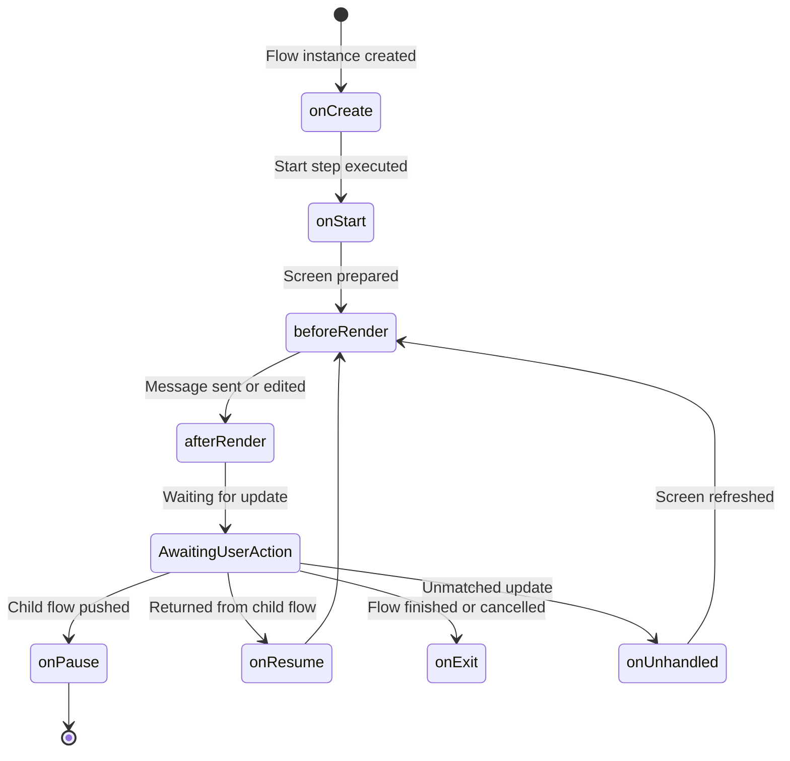

# Lifecycle Hooks

`InteractiveFlow` provides a predictable, component-based lifecycle. You can hook into each phase to load data, persist state, intercept exits, or update screens.



---

## 🪝 Lifecycle Reference

### `onCreate(): void`
Executed once when the flow instance is instantiated.
- **Use Case:** Load user profile, fetch records from a database, or initialize complex defaults.

### `onStart(): void`
Executed when entering the flow's entry point (`start`).
- **Use Case:** Reset step indicators or prepare initial parameters.

### `onResume(mixed $result = null): void`
Executed when the user returns to this flow after a child flow was popped off the stack via `$this->pop($result)`.
- **Use Case:** Process selection or return data from a sub-menu (e.g., chosen payment method or selected address) and re-render.

```php
public function onResume(mixed $result = null): void
{
    if ($result !== null) {
        $this->set('chosenAddress', $result);
    }
}
```

### `onPause(): void`
Executed immediately before this flow is suspended and a child flow is pushed onto the stack via `$this->push(...)`.
- **Use Case:** Persist transient form inputs or sync drafts.

### `beforeRender(Screen $screen): void`
Executed right before the `Screen` is rendered or edited in Telegram.
- **Use Case:** Dynamically inject badges, breadcrumbs, or user notification banners into the screen text or markup.

### `afterRender(mixed $sentMessage): void`
Executed immediately after a message is successfully sent or edited.
- **Use Case:** Audit logging or triggering secondary asynchronous tasks.

### `onUnhandled(Update $update): void`
Invoked when an incoming update does not match any registered `#[Action]`, `#[Input]`, or step method.
- **Default Behavior:** Calls `$this->refresh()` to re-render the screen in-place and keep the bot UI intact.

### `canInterrupt(Update $update): bool`
Invoked when `/start` or a cancellation command is received while the flow is active.
- **Return Value:**
  - `true` (default): Permits the user to exit or redirect to `rootFlow`.
  - `false`: Blocks the exit and keeps the user inside the flow.
- **Use Case:** Lock users into critical flows such as checkout, payment processing, or security verification.
