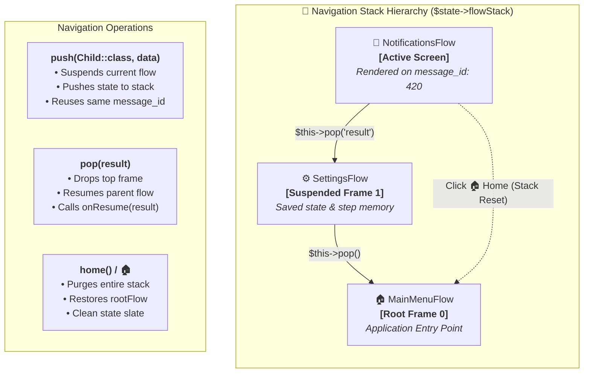
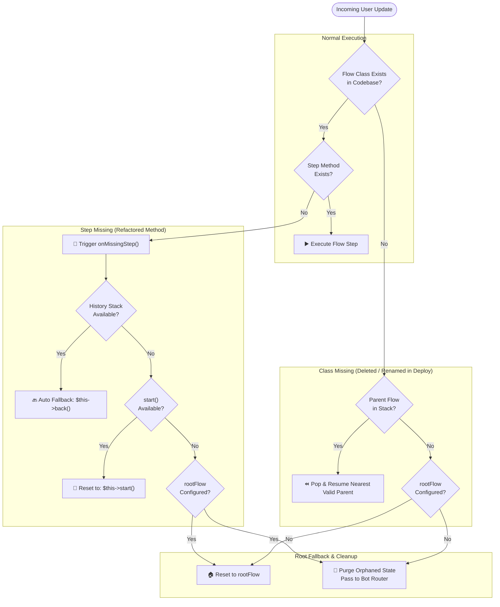

# Navigation Stack & Root Flow

`InteractiveFlow` features a hierarchical navigation stack that models menus and multi-layered screens just like modern UI frameworks.



---

## 🥞 Stack Navigation: `push()` and `pop()`

### `$this->push(string $childFlowClass, array $data = []): void`
Suspends the active flow, pushes its state onto `$state->flowStack`, and opens the child flow on the **exact same message ID** for zero-flicker transitions.

```php
#[Action('open_profile')]
public function openProfile(): void
{
    $this->push(UserProfileFlow::class, ['user_id' => 123]);
}
```

### `$this->pop(mixed $result = null): void`
Pops the active flow off the stack and restores the parent flow on the same message ID, executing the parent's `onResume($result)` hook with any returned data.

```php
#[Action('save_selection')]
public function saveSelection(): void
{
    $this->pop('English (US)');
}
```

---

## 🧭 Navigation Buttons: `🔙` Back and `🏠` Home

`Screen` includes a navigation bar with language-neutral emoji defaults:
- **Back Button:** `🔙` (triggers `$this->pop()`)
- **Home Button:** `🏠` (resets flow stack and jumps to `rootFlow`)

```php
// Enable both Back and Home:
Screen::make('Select an option:')
    ->withNavigation(back: true, home: true);

// Enable only Back:
Screen::make('Select an option:')
    ->withNavigation(back: true, home: false);

// Customizing labels:
Screen::make('Select an option:')
    ->withNavigation(
        back: true,
        home: true,
        backLabel: '🔙 Return',
        homeLabel: '🏠 Main Menu'
    );
```

> [!TIP]
> Navigation buttons work seamlessly on both **Inline Keyboards** (via callback query) and **Reply Keyboards** (via emoji text message `🔙` or `🏠`).

---

## 🏠 Configuring `rootFlow` & Handling `/start`

You can configure a global root flow on the client or FlowManager:

```php
$bot->setRootFlow(MainMenuFlow::class);

// Or through Config builder:
$config = Config::builder()
    ->token('...')
    ->rootFlow(MainMenuFlow::class)
    ->build();
```

### Global `/start` Behavior
When a user issues `/start` while in an active flow:
1. `FlowManager` checks `$activeFlow->canInterrupt($update)`.
2. If `true` (default), the entire flow stack is cleared, and the user is redirected to `rootFlow`.
3. If `false` (e.g. during checkout or an active form), the `/start` command is blocked, and the user remains safely in the active step.

---

## 🍞 Breadcrumbs Trail (`withBreadcrumbs`)

When nesting multi-level menus (e.g. `Catalog` » `Electronics` » `Headphones`), orient the user with an automatic breadcrumbs trail:

```php
use Tueen\Telegram\Flow\Attributes\Breadcrumb;

#[Breadcrumb('Headphones')]
class HeadphoneDetailsFlow extends InteractiveFlow
{
    public function render(): Screen
    {
        return Screen::make("Sony WH-1000XM5 Specs...")
            ->withBreadcrumbs(separator: ' » ')
            ->inline(...)
            ->withNavigation(back: true, home: true);
    }
}
```

This prefixes your screen text with:
```text
Catalog » Electronics » Headphones

Sony WH-1000XM5 Specs...
```

You can also customize the breadcrumb label dynamically via PHP 8.4 property hook:

```php
public string $breadcrumbTitle {
    get => $this->get('product_name', 'Item');
}
```

---

## 🛡️ Resilience & Missing Class Fallback

In long-running or distributed systems, code deployments may remove, rename, or refactor a Flow class while active users still have that Flow recorded in their persistent storage (e.g. `storage/flow/*.json` or Redis/database).

`tueen/telegram` features an intelligent, multi-layered resilience algorithm to ensure your bot never crashes or leaves users stranded:



### 1. Unwinding Navigation Stack to Parent Flows
If the user was inside a child flow (pushed via `$this->push(...)`) whose class was removed, `FlowManager` automatically inspects `$state->flowStack` and pops back to the nearest parent Flow that still exists, resuming it smoothly with its original state and `messageId`.

### 2. Fallback to `rootFlow` (Default Flow)
If the stack is empty (or parent classes were also removed), `FlowManager` checks if a `rootFlow` (or `defaultFlow`) is configured in `Config`:

```php
$config = Telegram::create('TOKEN')
    ->withRootFlow(MainMenuFlow::class) // or withDefaultFlow(MainMenuFlow::class)
    ->build();
```

When configured, the user's corrupted state is cleared and they are seamlessly redirected to the entry step of the root flow.

### 3. Missing Step Recovery (`onMissingStep`)
If a Flow class exists, but a specific step method was removed or renamed in code, `Flow::onMissingStep($step, $update)` is automatically invoked:
- It checks `$state->history` and navigates back one step.
- If history is empty, it attempts to return to the `start($update)` method.
- If a custom `$this->fallbackFlow` is set on the flow, it transitions there.
- Or it redirects to `rootFlow`.

You can also customize missing step handling directly on any Flow:

```php
class CustomFlow extends Flow
{
    protected ?string $fallbackFlow = HomeFlow::class;

    public function onMissingStep(string $step, Update $update): void
    {
        $this->bot->sendMessage(
            chatId: $this->chatId,
            text: "This section was recently updated. Taking you back..."
        );
        $this->back();
    }
}
```

### 4. Graceful Router Fallthrough
If no parent flows, root flows, or step recovery paths are available, `FlowManager` purges the orphaned session and returns `false`. This ensures the user's message is not discarded and is immediately handled by your regular command handlers, router attributes, or fallback routes.

