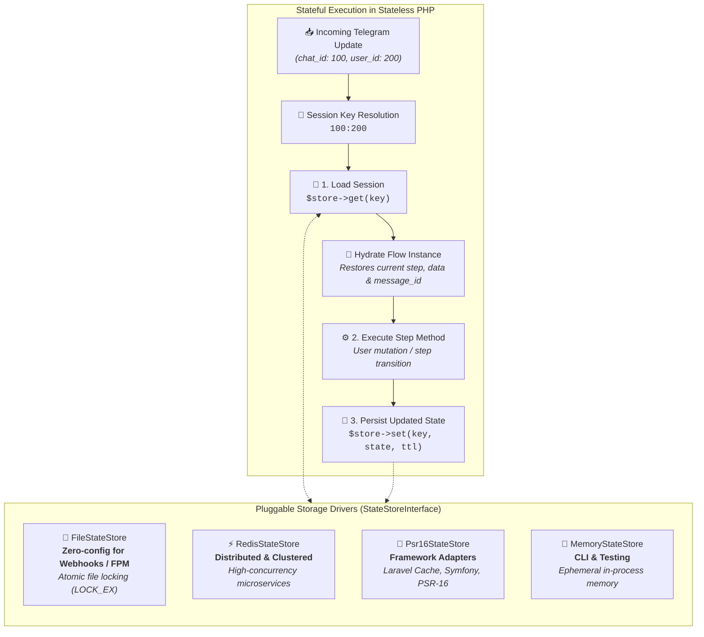

# State Storage Drivers

Flow sessions and interactive screen states are persisted between updates using pluggable state storage drivers.



---

## 💾 Available Storage Drivers

### 1. `FileStateStore` (Default for Webhooks)
Zero-configuration file-based storage for webhook environments (PHP-FPM, Apache). State is safely stored in temporary session files with atomic file locking and automatic expiration.

```php
use Tueen\Telegram\Flow\Storage\FileStateStore;

$bot->setFlowStore(new FileStateStore(directory: sys_get_temp_dir() . '/tueen_flows'));
```

### 2. `MemoryStateStore` (Default for CLI Polling)
In-memory array store. Ultra-fast and optimal for long-running daemon processes or unit test suites.

```php
use Tueen\Telegram\Flow\Storage\MemoryStateStore;

$bot->setFlowStore(new MemoryStateStore());
```

### 3. `RedisStateStore` (High-Concurrency & Distributed)
Native Redis driver supporting Redis clusters, automatic TTL expiration, and cross-server session sharing.

```php
use Tueen\Telegram\Flow\Storage\RedisStateStore;

$redis = new \Redis();
$redis->connect('127.0.0.1', 6379);

$bot->setFlowStore(new RedisStateStore(redis: $redis, prefix: 'tueen:flow:'));
```

### 4. `Psr16StateStore` (Framework Adapters)
Integrates with any PSR-16 compliant cache (Laravel Cache, Symfony Cache, etc.).

```php
use Tueen\Telegram\Flow\Storage\Psr16StateStore;

$bot->setFlowStore(new Psr16StateStore($psr16CachePool));
```
