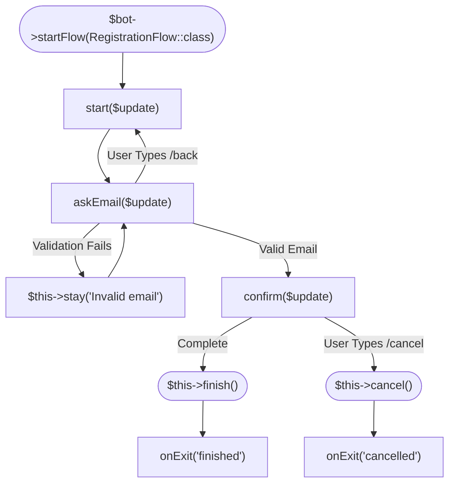
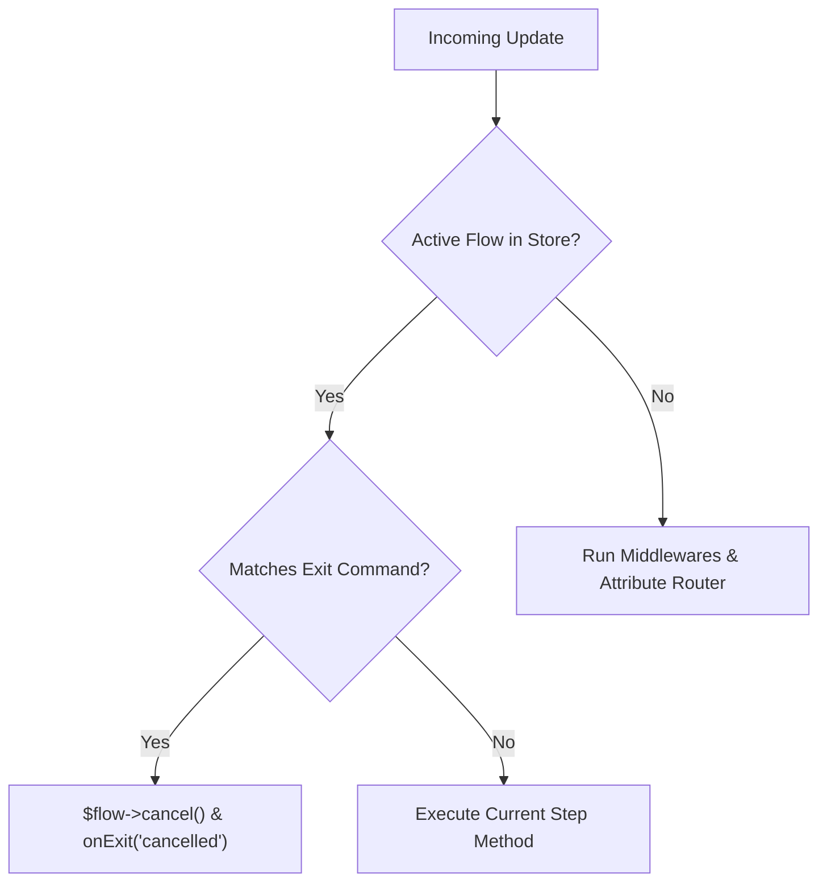

# Flows

When building Telegram bots, multi-step user dialogues (such as user onboarding wizards, e-commerce checkouts, surveys, booking forms, or customer support tickets) quickly turn into unmaintainable spaghetti code when managed through manual database flags or nested `if/else` conditions.

`tueen/telegram` introduces **`Flow`** — a modern, elegant, class-based state machine engineered specifically for conversational bot architectures.



---

## 🏛️ 1. Architecture of a Flow

Every conversational interaction is defined as a dedicated class extending `Tueen\Telegram\Flow\Flow`.

### Core Architectural Pillars
1. **Isolated Classes:** Each dialogue has its own encapsulated class, eliminating global state leakage.
2. **Steps are Methods:** Every step in the flow is simply a public method accepting an `Update $update`.
3. **Automatic Update Prioritization:** When a user is in an active Flow, their incoming updates are automatically routed to their current flow step inside `$bot->run()`, seamlessly bypassing general command routers and fallback handlers.
4. **History Stack:** Tueen automatically tracks step navigation history, making back navigation (`$this->back()`) effortless.
5. **Pluggable Persistence:** State can be persisted across requests using Memory, Files, Redis, or any PSR-16 cache driver.

---

## 📦 2. Properties Injected into Flow

When a Flow is executed, the following properties are automatically initialized and accessible via `$this`:

| Property | Type | Description |
| :--- | :--- | :--- |
| **`$this->bot`** | `Telegram` | The active Telegram client instance for calling methods, sending keyboards, etc. |
| **`$this->update`** | `Update` | The incoming Telegram `Update` object that triggered the current step. |
| **`$this->chatId`** | `int\|string` | Resolved Telegram Chat ID for the conversation. |
| **`$this->userId`** | `?int` | Resolved Telegram User ID (enables distinct user sessions inside group chats). |
| **`$this->state`** | `FlowState` | Underlying state object storing `flowClass`, `currentStep`, `data`, and `history`. |
| **`$this->manager`** | `FlowManager` | The orchestrating `FlowManager` instance handling persistence and step transitions. |

### Configurable Protected Properties

You can customize flow behavior by overriding protected properties on your Flow class:

```php
abstract class Flow
{
    /**
     * Commands that immediately abort and cancel the flow.
     * Default: ['/cancel', '/exit', '/stop']
     */
    protected array $exitCommands = ['/cancel', '/exit', '/stop'];

    /**
     * Time-to-live for this flow session in seconds.
     * Default: 3600 (1 hour). Set to null for indefinite persistence.
     */
    protected ?int $ttl = 3600;
}
```

---

## 🛠️ 3. Comprehensive Method Reference

Every class extending `Flow` inherits a rich set of navigation, lifecycle, and data management methods.

### 🧭 Navigation & Step Control Methods

#### `$this->to(string $stepMethod, array $data = []): static`
Advances the user to the specified step method on their next incoming update.
- **History Tracking:** Automatically pushes the current step method name onto the `$state->history` stack.
- **State Merging:** Merges any provided `$data` into the persistent session store.
- **Auto-Persist:** Automatically saves updated state and resets the session TTL.

```php
// Advance to the 'askAddress' step:
$this->to('askAddress');

// Advance and merge additional data in one atomic call:
$this->to('askAddress', ['selected_item' => 'Pepperoni Pizza']);
```

---

#### `$this->stay(?string $replyMessage = null, mixed $keyboard = null): static`
Keeps the user on the current step. Does not modify the step history stack.
- **Validation Retries:** Ideal when user input fails validation and they must retry the current step.
- **Instant Prompt:** If `$replyMessage` is provided, automatically sends it via `$this->bot->sendMessage()`.
- **Keyboard Support:** Supports passing an `InlineKeyboard` or `ReplyKeyboard` directly in the second parameter.
- **Auto-Persist:** Refreshes the session TTL in storage.

```php
if (!filter_var($email, FILTER_VALIDATE_EMAIL)) {
    // Retain step, send error message, and wait for new input:
    $this->stay('⚠️ Invalid email address! Please enter a valid email:');
    return;
}

// Retain step and display an inline keyboard:
$keyboard = InlineKeyboard::make()
    ->button('Option A', callbackData: 'opt_a')
    ->button('Option B', callbackData: 'opt_b');

$this->stay('Please select an option to proceed:', keyboard: $keyboard);
```

---

#### `$this->back(?string $replyMessage = null): static`
Navigates the user backward to their previous step in the flow.
- **History Stack Pop:** Pops the most recent step name from `$state->history` and sets it as the new `currentStep`.
- **Fallback Termination:** If the history stack is empty (e.g. user is on the first step), it automatically invokes `$this->finish()`.
- **Optional Prompt:** Sends `$replyMessage` to the user if provided.

```php
if ($userText === 'back' || $userText === '/back') {
    $this->back('⬅️ Returning to the previous step. What is your full name?');
    return;
}
```

---

#### `$this->finish(): void`
Marks the flow as successfully completed.
- **Purge State:** Permanently deletes the session state from the active storage driver.
- **Termination Flag:** Sets internal `$this->isTerminated = true` to prevent subsequent state saves.
- **Lifecycle Hook:** Fires `$this->onExit($update, 'finished')`.

```php
$this->bot->sendMessage(
    chatId: $this->chatId,
    text: '🎉 Thank you! Your order has been placed.'
);

$this->finish();
```

---

#### `$this->cancel(?string $replyMessage = 'Operation cancelled.'): void`
Aborts the flow immediately.
- **Purge State:** Deletes the session state from the active storage driver.
- **Termination Flag:** Sets internal `$this->isTerminated = true`.
- **Lifecycle Hook:** Fires `$this->onExit($update, 'cancelled')`.
- **User Notification:** Automatically sends `$replyMessage` unless `null` is passed.

```php
// User typed /cancel or chose to abort:
$this->cancel('❌ Registration has been cancelled. Type /register to start again.');
```

---

#### `$this->jumpTo(string $flowClass, string $initialStep = 'start', array $initialData = [], array $data = []): void`
Hands off the conversation to another `Flow` class seamlessly.
- **Interruption Hook:** Fires `$this->onExit($update, 'interrupted')` on the departing flow.
- **Data Carry-Over:** Inherits all existing state data from the current flow and merges it with `$initialData`.
- **Immediate Step Execution:** Automatically starts the target flow and immediately invokes its `$initialStep` method.

```php
// In CheckoutFlow: user needs to update their profile first
if (!$this->has('phone_number')) {
    $this->jumpTo(ProfileUpdateFlow::class, initialStep: 'askPhone');
    return;
}
```

---

### 🔄 Lifecycle Hooks & Interceptors

#### `start(Update $update): void`
The default entry-point step when a Flow is initiated without specifying a custom initial step.
Child classes should implement or override this method:

```php
public function start(Update $update): void
{
    $this->bot->sendMessage(chatId: $this->chatId, text: 'Welcome! What is your name?');
    $this->to('askEmail');
}
```

---

#### `onExit(Update $update, string $reason): void`
Lifecycle cleanup hook invoked whenever a flow terminates for any reason.
- **`$reason` values:**
  - `'finished'` — Flow ended normally via `$this->finish()`.
  - `'cancelled'` — Flow was cancelled via `$this->cancel()` or matched an exit command.
  - `'interrupted'` — Flow was handed off to another flow via `$this->jumpTo()`.

```php
public function onExit(Update $update, string $reason): void
{
    if ($reason === 'cancelled') {
        // Release reserved database stock, clear temp files, log telemetry:
        $orderId = $this->get('order_id');
        OrderService::releaseReservation($orderId);
    }
}
```

---

#### `shouldExit(Update $update): bool`
Determines if an incoming update matches any of the registered `$exitCommands`.
- Automatically strips bot usernames (e.g. `/cancel@MyBot` is normalized to `/cancel`).
- Case-insensitive comparison.

---

### 💾 State Data Management Methods

All data gathered across conversation steps is stored in the persistent session. `Flow` provides both expressive methods and magic property access:

| Method | Return Type | Description |
| :--- | :--- | :--- |
| **`set(string $key, mixed $value)`** | `static` | Stores a key-value pair and persists the state. |
| **`get(string $key, mixed $default = null)`** | `mixed` | Retrieves a stored key with an optional default value. |
| **`has(string $key)`** | `bool` | Checks if a key exists in the flow state. |
| **`remove(string $key)`** | `static` | Removes a key and updates persistent storage. |
| **`all()`** | `array<string, mixed>` | Returns all stored state data as an associative array. |
| **`clearData()`** | `static` | Clears all data while retaining the current step and history. |

#### Magic Property Syntax
You can also read, write, and check flow state data using standard PHP object properties:

```php
// Set values:
$this->customerName = 'Alice';
$this->itemsCount = 3;

// Read values:
echo $this->customerName; // "Alice"

// Check existence:
if (isset($this->customerName)) {
    // ...
}

// Remove:
unset($this->itemsCount);
```

---

### 🔑 Session & Inspection Utilities

- **`sessionKey(): string`** — Returns the resolved storage key (e.g. `"chat:123456"` in private chats, or `"chat:-100123:user:98765"` in groups).
- **`isTerminated(): bool`** — Returns `true` if the flow has called `finish()`, `cancel()`, or `jumpTo()`.
- **`getTtl(): ?int`** — Returns the configured TTL in seconds.

---

## 🚀 4. Initiating and Running Flows

### Triggering via `$bot->startFlow()`
You can initiate a Flow from any command handler, callback query, or attribute controller:

```php
use App\Flows\OrderFlow;
use Tueen\Telegram\Telegram;
use Tueen\Telegram\Types\Update;

// Trigger from a standard command:
$bot->onCommand('order', function (Update $update, Telegram $bot) {
    $bot->startFlow(OrderFlow::class);
});

// Trigger with initial custom data:
$bot->onCallbackQuery('buy_vip', function (Update $update, Telegram $bot) {
    $bot->startFlow(OrderFlow::class, initialData: [
        'plan' => 'vip_monthly',
        'price' => 29.99,
    ]);
});
```

---

### Automatic Flow Priority in `$bot->run()`

When incoming updates arrive at `$bot->run()`, Tueen executes in the following order:



Because active flows take precedence, your users remain immersed in their multi-step flow without accidental interference from global commands.

---

## 🗄️ 5. State Storage Drivers (`StateStoreInterface`)

Tueen includes four production-ready state stores:

### 1. `FileStateStore` (Default for Web & Webhooks)
Automatically activated when running under Web server SAPIs (`fpm-fcgi`, `apache2handler`, etc.) where PHP memory is ephemeral.
- Stores sessions as individual JSON files on disk.
- Atomic file writes with locking (`LOCK_EX`) to prevent race conditions.
- Automatic directory creation and expired session garbage collection.

```php
use Tueen\Telegram\Flow\Storage\FileStateStore;

// Custom storage directory:
$bot->setFlowStore(new FileStateStore(storageDir: '/var/run/bot_flows'));
```

---

### 2. `RedisStateStore` (High-Throughput & Multi-Server)
High-performance distributed storage for cloud environments and scaled bot deployments. Supports both native `\Redis` and `Predis`:

```php
use Tueen\Telegram\Flow\Storage\RedisStateStore;

$redis = new \Redis();
$redis->connect('127.0.0.1', 6379);

$bot->setFlowStore(new RedisStateStore(
    redis: $redis,
    prefix: 'telegram:flow:'
));
```

---

### 3. `Psr16StateStore` (Framework Cache Integration)
Integrate with any PSR-16 `SimpleCache` implementation (such as Laravel `Cache::store()` or Symfony Cache):

```php
use Tueen\Telegram\Flow\Storage\Psr16StateStore;

// In Laravel:
$bot->setFlowStore(new Psr16StateStore(app('cache.store')));
```

---

### 4. `MemoryStateStore` (CLI & Testing)
Stores state in a local PHP array. Default in CLI environments. Perfect for unit testing with zero filesystem I/O:

```php
use Tueen\Telegram\Flow\Storage\MemoryStateStore;

$bot->setFlowStore(new MemoryStateStore());
```

---

## 💉 6. Dependency Injection & Containers

`FlowManager` is fully integrated with PSR-11 containers. If you configure a container via `$bot->setContainer($container)` or `ConfigBuilder::withContainer($container)`, Flow instances will be resolved through your DI container:

```php
namespace App\Flows;

use Tueen\Telegram\Flow\Flow;
use App\Services\PaymentService;
use App\Services\UserRepository;

class PremiumCheckoutFlow extends Flow
{
    // Injected automatically by your PSR-11 container:
    public function __construct(
        private readonly PaymentService $payments,
        private readonly UserRepository $users
    ) {}

    public function start(Update $update): void
    {
        // ...
    }
}
```

---

## 🍕 7. Complete Real-World Example: Pizza Ordering Flow

Here is a full, end-to-end example demonstrating validation, keyboard prompts, back navigation, data persistence, and graceful completion:

```php
namespace App\Flows;

use Tueen\Telegram\Flow\Flow;
use Tueen\Telegram\Types\Update;
use Tueen\Telegram\Keyboards\InlineKeyboard;
use Tueen\Telegram\Keyboards\ReplyKeyboard;

class PizzaOrderFlow extends Flow
{
    // Step 1: Select Pizza Size
    public function start(Update $update): void
    {
        $keyboard = InlineKeyboard::make()
            ->button('Small (10")', callbackData: 'size:small')
            ->button('Medium (12")', callbackData: 'size:medium')
            ->row()
            ->button('Large (16")', callbackData: 'size:large');

        $this->bot->sendMessage(
            chatId: $this->chatId,
            text: '🍕 Welcome to Tueen Pizza! Please select your pizza size:',
            replyMarkup: $keyboard
        );

        $this->to('askCrust');
    }

    // Step 2: Handle Size and Choose Crust
    public function askCrust(Update $update): void
    {
        $callback = $update->callbackQuery;
        if ($callback === null || !str_starts_with($callback->data, 'size:')) {
            $this->stay('Please select a valid size using the buttons above!');
            return;
        }

        $size = explode(':', $callback->data)[1];
        $this->set('size', $size);
        $callback->answer();

        $keyboard = ReplyKeyboard::make()
            ->button('Thin Crust')
            ->button('Cheese Stuffed')
            ->row()
            ->button('⬅️ Back')
            ->resizeKeyboard();

        $this->bot->sendMessage(
            chatId: $this->chatId,
            text: "Selected size: <b>{$size}</b>. Now choose your crust:",
            replyMarkup: $keyboard
        );

        $this->to('askAddress');
    }

    // Step 3: Handle Crust and Request Delivery Address
    public function askAddress(Update $update): void
    {
        $text = trim($update->findAnyText() ?? '');

        // Support backward navigation:
        if ($text === '⬅️ Back') {
            $this->back('Returning to size selection:');
            return;
        }

        if (!in_array($text, ['Thin Crust', 'Cheese Stuffed'], true)) {
            $this->stay('Please choose one of the available crust options below!');
            return;
        }

        $this->set('crust', $text);

        // Remove reply keyboard and request address
        $this->bot->sendMessage(
            chatId: $this->chatId,
            text: 'Great! Where should we deliver your pizza? Please send your street address:',
            replyMarkup: ReplyKeyboard::remove()
        );

        $this->to('confirmOrder');
    }

    // Step 4: Validate Address and Finalize Order
    public function confirmOrder(Update $update): void
    {
        $address = trim($update->findAnyText() ?? '');

        if (mb_strlen($address) < 5) {
            $this->stay('Address is too short. Please provide a complete delivery address:');
            return;
        }

        $this->set('address', $address);

        $summary = "🎉 <b>Order Confirmed!</b>\n\n" .
                   "• Size: {$this->get('size')}\n" .
                   "• Crust: {$this->get('crust')}\n" .
                   "• Address: {$this->get('address')}\n\n" .
                   "Your fresh pizza will arrive in 30 minutes!";

        $this->bot->sendMessage(
            chatId: $this->chatId,
            text: $summary
        );

        // Complete the flow and clear session state
        $this->finish();
    }

    // Optional lifecycle cleanup
    public function onExit(Update $update, string $reason): void
    {
        if ($reason === 'cancelled') {
            $this->bot->sendMessage(
                chatId: $this->chatId,
                text: 'Order cancelled. Hope to see you again soon!'
            );
        }
    }
}
```
