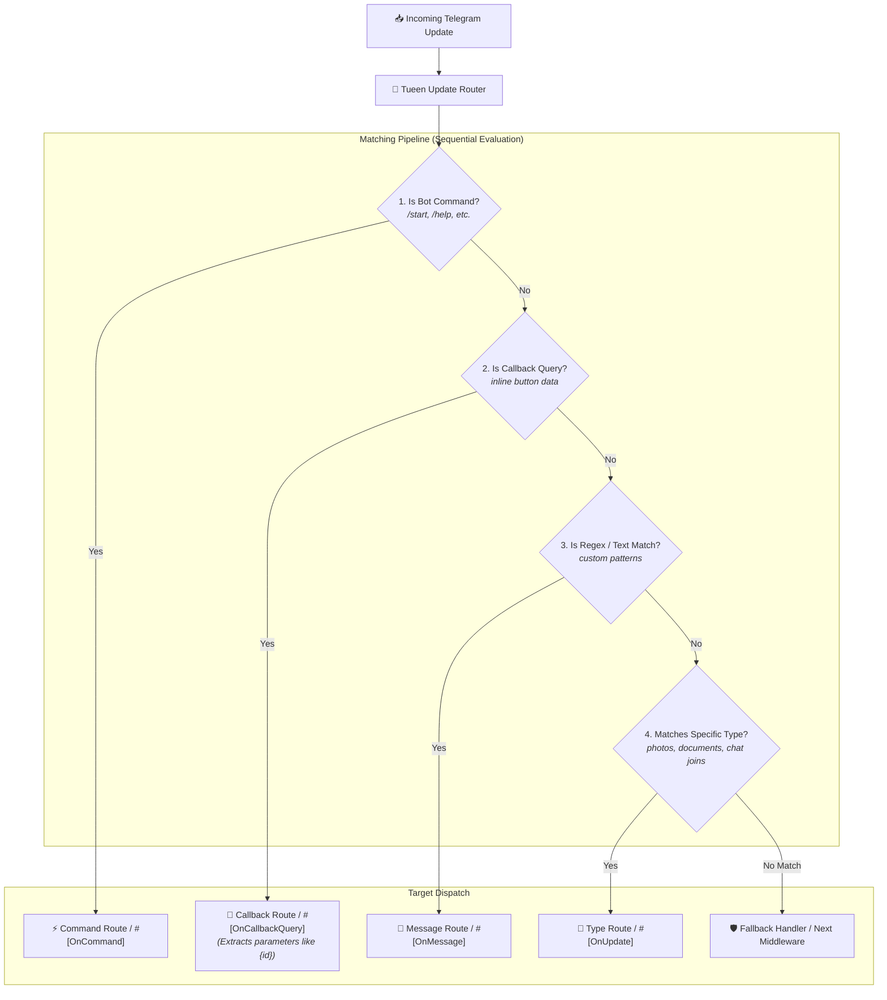

# Update Routing & Attributes

Instead of writing monolithic `switch` or `if/else` ladders inside your update handlers, `tueen/telegram` features an expressive, type-safe **Update Router**.

The router supports both **Fluent Route Definitions** and **Attribute-Driven Controllers** (via PHP 8 Attributes).



---

## ⚡ 1. Fluent Routing

You can register routes directly on your `Telegram` client instance.

```php
use Tueen\Telegram\Telegram;
use Tueen\Telegram\Types\Update;

$bot = new Telegram('YOUR_BOT_TOKEN');

// 1. Handle bot commands (/start, /help, etc.)
// Bot username (@my_bot) is stripped automatically:
$bot->onCommand('start', function (Update $update, Telegram $bot) {
    $bot->sendMessage(
        chatId: $update->findChat()->id,
        text: 'Welcome! How can I assist you today?'
    );
});

// 2. Handle callback queries with parameterized patterns
$bot->onCallbackQuery('item:{id}:details', function (Update $update, Telegram $bot, string $id) {
    $bot->answerCallbackQuery(callbackQueryId: $update->callbackQuery->id);
    $bot->sendMessage(
        chatId: $update->findChat()->id,
        text: "Viewing details for item #{$id}"
    );
});

// 3. Handle messages matching a regex pattern
$bot->onMessage('/^contact support$/i', function (Update $update, Telegram $bot) {
    $bot->sendMessage(
        chatId: $update->findChat()->id,
        text: 'A support agent will reach out shortly.'
    );
});

// 4. Handle inline queries
$bot->onInlineQuery(function (Update $update, Telegram $bot) {
    $query = $update->inlineQuery->query;
    // Answer inline query...
});

// 5. Catch-all fallback route
$bot->onFallback(function (Update $update, Telegram $bot) {
    $bot->sendMessage(
        chatId: $update->findChat()?->id,
        text: 'Sorry, I did not understand that command.'
    );
});

// Execute the bot (automatically triggers router dispatch)
$bot->run();
```

---

## 🎯 2. Parameter Extraction in Routes

The router provides first-class support for parameterized patterns using `{paramName}`:

```php
$bot->onCallbackQuery('cart:add:{productId}:{quantity}', function (
    Update $update,
    Telegram $bot,
    string $productId,
    string $quantity
) {
    // Parameters are automatically injected into the handler arguments!
});
```

You can also use full regular expressions:

```php
$bot->onCallbackQuery('/^order_(?P<action>approve|reject)_(?P<id>\d+)$/', function (
    Update $update,
    Telegram $bot,
    string $action,
    string $id
) {
    // Named regex capture groups are passed as parameters
});
```

---

## 🏛️ 3. Attribute-Driven Controllers

For medium to large applications, you can organize your routes into dedicated Controller classes decorated with PHP 8 Attributes:

### Example Controller

```php
namespace App\Controllers;

use Tueen\Telegram\Telegram;
use Tueen\Telegram\Types\Update;
use Tueen\Telegram\Routing\Attributes\OnCommand;
use Tueen\Telegram\Routing\Attributes\OnCallbackQuery;
use Tueen\Telegram\Routing\Attributes\OnMessage;
use Tueen\Telegram\Routing\Attributes\OnInlineQuery;

class ShopController
{
    #[OnCommand('shop')]
    public function openShop(Update $update, Telegram $bot): void
    {
        $bot->sendMessage(
            chatId: $update->findChat()->id,
            text: 'Welcome to our shop!'
        );
    }

    #[OnCallbackQuery('product:{id}')]
    public function showProduct(Update $update, Telegram $bot, string $id): void
    {
        $bot->answerCallbackQuery($update->callbackQuery->id);
        $bot->sendMessage(
            chatId: $update->findChat()->id,
            text: "Loading product #{$id}..."
        );
    }

    #[OnMessage('/^\$([0-9\.]+)$/')]
    public function handleTip(Update $update, Telegram $bot, string $amount): void
    {
        $bot->sendMessage(
            chatId: $update->findChat()->id,
            text: "Received tip: \${$amount}"
        );
    }

    #[OnInlineQuery]
    public function search(Update $update, Telegram $bot): void
    {
        // Handle inline query
    }
}
```

### Registering Controllers

Register controllers with `$bot->registerController(...)`:

```php
$bot->registerController(ShopController::class);
$bot->registerController(UserController::class);

$bot->run();
```

If a PSR-11 container is configured (`$bot->setContainer($container)`), controller instances and their constructor dependencies will be resolved automatically.

---

## 🧭 4. Routing API Catalog

Below is the complete reference of routing attributes and router configuration methods.

### 🏷️ Routing Attributes (`Tueen\Telegram\Routing\Attributes\`)

<ApiGroup description="Declarative attributes for decorating controller methods.">
  <ApiCard
    sig="#[OnCommand(string $command)]"
    returns="Attribute"
    badge="Attribute"
    desc="Matches Telegram bot commands (e.g. /start, /help). Bot username suffix (@bot) is handled automatically."
  />
  <ApiCard
    sig="#[OnCallbackQuery(?string $pattern = null)]"
    returns="Attribute"
    badge="Attribute"
    desc="Matches inline keyboard callback queries against an exact string, parameterized pattern ('item:{id}'), or regex."
  />
  <ApiCard
    sig="#[OnMessage(?string $pattern = null)]"
    returns="Attribute"
    badge="Attribute"
    desc="Matches text messages against an exact string, regex (/pattern/i), or matches all messages if pattern is null."
  />
  <ApiCard
    sig="#[OnInlineQuery(?string $pattern = null)]"
    returns="Attribute"
    badge="Attribute"
    desc="Matches incoming Telegram inline queries matching an optional query string pattern."
  />
  <ApiCard
    sig="#[OnUpdate(UpdateType|string $type)]"
    returns="Attribute"
    badge="Attribute"
    desc="Matches specific Telegram update types (e.g. UpdateType::CHANNEL_POST, 'chat_member', etc.)."
  />
  <ApiCard
    sig="#[Fallback]"
    returns="Attribute"
    badge="Attribute"
    desc="Marks a method as the default fallback handler when no other routes or active conversational flows match."
  />
</ApiGroup>

---

## 🚨 4. Priority Routes (Overriding Active Flows)

By default, an active conversational `Flow` session takes precedence over standard routes in `Router` to keep the user immersed in multi-step dialogues.

However, certain commands (such as `/help`, `/support`, `/cancel`, `/emergency`, or admin overrides) need to execute **even when a user is in the middle of a Flow**.

### Registering Priority Routes
Pass `priority: true` to fluent route methods or routing attributes:

```php
// 1. Fluent Priority Route:
$bot->onCommand('help', function (Update $update, Telegram $bot) {
    $bot->sendMessage(chatId: $bot->chatId, text: 'Need assistance? Contact @support.');
}, priority: true);

// 2. Attribute-Driven Priority Route:
class SupportController
{
    #[OnCommand('emergency', priority: true)]
    public function emergency(Update $update, Telegram $bot): void
    {
        $bot->sendMessage(chatId: $bot->chatId, text: 'Emergency operator notified!');
    }
}
```

### Flow Customization & Interception
When a priority route matches, Tueen offers the active Flow complete control through two lifecycle hooks:

1. **`allowsPriorityRoute(Route $route, Update $update): bool`** — Return `false` to intercept and veto the priority route, keeping execution entirely inside the Flow.
2. **`onPriorityRoute(Route $route, Update $update): void`** — Executed when the priority route is permitted to run, allowing the Flow to pause itself, clean up UI screens, or record that a global command occurred.

---

### 🛣️ `Router` Methods (`Tueen\Telegram\Routing\Router`)

<ApiGroup description="Methods on the Router instance (also proxied directly on the Telegram client facade).">
  <ApiCard
    sig="onCommand(string $command, mixed $handler, bool $priority = false): static"
    returns="static"
    badge="Registration"
    desc="Registers a route for a bot command name (e.g. 'start', '/help'). Set priority: true to allow overriding active Flows."
  />
  <ApiCard
    sig="onCallbackQuery(?string $pattern, mixed $handler, bool $priority = false): static"
    returns="static"
    badge="Registration"
    desc="Registers a route for callback queries matching an optional pattern or regex."
  />
  <ApiCard
    sig="onMessage(?string $pattern, mixed $handler, bool $priority = false): static"
    returns="static"
    badge="Registration"
    desc="Registers a route for messages matching an optional pattern or regex."
  />
  <ApiCard
    sig="onInlineQuery(?string $pattern, mixed $handler, bool $priority = false): static"
    returns="static"
    badge="Registration"
    desc="Registers a route for inline queries matching an optional pattern."
  />
  <ApiCard
    sig="on(UpdateType|string $type, mixed $handler, bool $priority = false): static"
    returns="static"
    badge="Registration"
    desc="Registers a route targeting a specific UpdateType enum or string."
  />
  <ApiCard
    sig="onFallback(mixed $handler): static"
    returns="static"
    badge="Registration"
    desc="Registers a fallback handler when no other routes or active conversational flows match."
  />
  <ApiCard
    sig="registerController(string|object $controller): static"
    returns="static"
    badge="Registration"
    desc="Registers an attribute-decorated controller class name or object instance."
  />
  <ApiCard
    sig="dispatch(Update $update, ?Telegram $bot = null): bool"
    returns="bool"
    badge="Execution"
    desc="Dispatches an incoming update to the first matching route. Returns true if handled."
  />
</ApiGroup>
