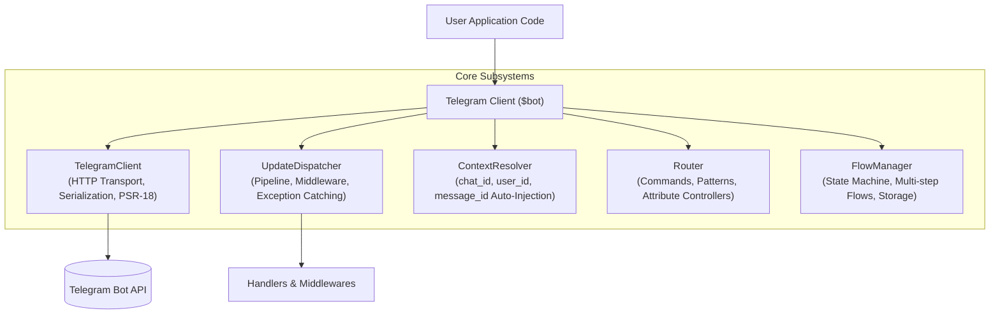

# The Telegram Client

The `Tueen\Telegram\Telegram` class (conventionally instantiated as `$bot`) is the primary entry point and client facade of the `tueen/telegram` library. It provides a unified, strictly typed interface for sending Bot API requests, listening for updates, managing multi-step flows, and resolving contextual parameters.

---

## 🚀 1. Instantiation

You can initialize the client either directly with your bot token or via a pre-built `Config` object:

### Basic Instantiation
```php
use Tueen\Telegram\Telegram;

$bot = new Telegram('YOUR_BOT_TOKEN');
```

### Advanced Instantiation with `ConfigBuilder`
For production environments requiring custom timeouts, proxy connections, retry policies, or test servers:
```php
use Tueen\Telegram\Telegram;

$config = Telegram::create('YOUR_BOT_TOKEN')
    ->withTimeout(30.0)
    ->withRetryCount(3)
    ->build();

$bot = new Telegram($config);
```
> For a full list of networking and runtime settings, see the [Configuration Reference](./configuration).

---

## ⚡ 2. The Three Primary Roles of `$bot`

In your application, the `$bot` instance serves three essential purposes:

### 1. Direct Bot API Client
You can invoke all Telegram Bot API methods dynamically with full IDE autocompletion and named arguments:
```php
$bot->sendMessage(
    chatId: 123456789,
    text: 'Hello from tueen/telegram!'
);
```
> Learn more in [Calling Methods & Types](./methods-and-types).

### 2. Update Router & Dispatcher
The client listens for incoming updates and dispatches them to closures, classes, or attribute controllers:
```php
// Register a command route:
$bot->onCommand('start', function (Update $update, Telegram $bot) {
    $bot->sendMessage(text: 'Welcome! How can I assist you today?');
});

// Run the bot via Webhook, Polling, or AutoMode:
$bot->run();
```
> Learn more in [Update Routing & Attributes](./routing) and [Running Modes](./running-modes).

### 3. Contextual Entity Resolver
During update processing, `$bot` automatically tracks the active update and provides instant shortcuts to chat, user, and message identifiers:
```php
$chatId  = $bot->chatId();  // e.g. 123456789
$userId  = $bot->userId();  // e.g. 987654321
$message = $bot->message(); // Current ?Message instance
```
> Learn more in [Update & Message Helpers](./update-and-message-helpers).

---

## 💡 3. Client Best Practices

Here are the recommended patterns to keep in mind when working with the `$bot` instance:

### 1. Always Use PHP Named Arguments
Telegram Bot API methods accept many optional parameters. Named arguments protect your code against parameter order changes and enable **Contextual Auto-Injection** (where repetitive parameters like `chatId` are automatically resolved from the active update):

```php
// ✅ RECOMMENDED: Order-independent, self-documenting, auto-injects chatId:
$bot->sendMessage(
    text: 'Order confirmed successfully.',
    parseMode: ParseMode::HTML
);

// ❌ AVOID: Fragile positional arguments with trailing nulls:
$bot->sendMessage(123456, 'Order confirmed successfully.', null, null, null, null, 'HTML');
```

### 2. Reusing a Single Client Instance
`Telegram` is lightweight and designed to be created once. In modern frameworks (such as Laravel, Symfony, or Slim), register `$bot` as a singleton in your dependency injection container:

```php
// Example: Registering as a singleton in a PSR-11 container:
$container->singleton(Telegram::class, function () {
    return new Telegram(getenv('TELEGRAM_BOT_TOKEN'));
});
```

### 3. Organizing Complex Bots with Controllers
For simple bots, defining routes with closures directly in your script is quick and convenient. As your application grows, organize your commands and actions into dedicated Controller classes:

```php
// Register a dedicated controller class decorated with routing attributes:
$bot->registerController(OrderController::class);
```
> See [Attribute-Driven Controllers](./routing#3-attribute-driven-controllers) for examples of using `#[OnCommand]` and `#[OnCallbackQuery]`.

---

## 🏛️ 4. Architecture & Decoupled Subsystems

Under the hood, `Telegram` is not a monolithic class holding all bot logic. Instead, it uses a **modular composition architecture** that delegates work to single-responsibility components:



### When to Access Subsystems Directly:
Most of the time, you interact exclusively with the `$bot` facade. However, you can access underlying subsystems when building low-level extensions, worker queues, or custom integrations:

```php
use Tueen\Telegram\Telegram;

$bot = new Telegram('YOUR_BOT_TOKEN');

// 1. Pure HTTP client (useful for worker queue jobs that only call API methods without processing updates):
$client = $bot->getClient();
$me = $client->getMe();

// 2. Underlying router instance:
$router = $bot->router();

// 3. Flow state manager (for custom state stores or manual session manipulation):
$flowManager = $bot->flowManager();

// 4. Context parameter resolver:
$context = $bot->context();
```

---

## 🧭 5. Complete Method & Property Reference

Below is the comprehensive catalog of all constants, properties, and methods provided on the `Telegram` class, grouped by architectural responsibility. Every item features syntax-highlighted signatures, parameter types, default values, and status badges.

### 🏛️ Class Constants & Public Properties

<ApiGroup description="Core version identifiers and read-only subsystem properties protected by PHP 8.4 asymmetric visibility.">
  <ApiCard
    type="constant"
    sig="public const string BOT_API_VERSION = '10.3'"
    returns="string"
    badge="Constant"
    desc="Canonical Telegram Bot API version currently supported and validated against (10.3)."
  />
  <ApiCard
    type="constant"
    sig="public const string API_VERSION = self::BOT_API_VERSION"
    returns="string"
    badge="Alias"
    aliasFor="Telegram::BOT_API_VERSION"
    desc="Shorthand alias for BOT_API_VERSION for cleaner references."
  />
  <ApiCard
    type="property"
    sig="public private(set) ?Update $update = null"
    returns="?Update"
    badge="Asymmetric Visibility"
    desc="Current resolved Update instance for the active request lifecycle. Defaults to null until resolved by WebhookMode or PollingMode."
  />
  <ApiCard
    type="property"
    sig="public private(set) ContextResolver $context"
    returns="ContextResolver"
    badge="Asymmetric Visibility"
    desc="Contextual parameter resolver instance automatically bound to $update for argument auto-injection."
  />
  <ApiCard
    type="property"
    sig="public private(set) TelegramClient $client"
    returns="TelegramClient"
    badge="Asymmetric Visibility"
    desc="Underlying pure HTTP transport client handling serialization, multipart uploads, and PSR-18 communication."
  />
  <ApiCard
    type="property"
    sig="public private(set) UpdateDispatcher $dispatcher"
    returns="UpdateDispatcher"
    badge="Asymmetric Visibility"
    desc="Incoming update dispatcher managing the middleware pipeline, route execution, and exception catchers."
  />
</ApiGroup>

---

### A. Initialization & Testing Factory

<ApiGroup description="Instantiation shortcuts, immutable configuration loading, and testing fakes.">
  <ApiCard
    sig="Telegram::create(string $botToken)"
    returns="ConfigBuilder"
    badge="Factory"
    desc="Initializes a fluent ConfigBuilder for configuring network timeouts, persistent cURL handles, proxies, retries, and running modes."
  />
  <ApiCard
    sig="Telegram::fake(array $responses = [], string $botToken = 'FAKE_BOT_TOKEN')"
    returns="TelegramFake"
    badge="Testing"
    desc="Creates an in-memory testing fake client with recording capabilities and assertion helpers (assertSent, assertSentCount, assertNotSent)."
  />
  <ApiCard
    sig="new Telegram(string|Config $tokenOrConfig)"
    returns="Telegram"
    badge="Constructor"
    desc="Instantiates the primary Telegram client directly using either a plain bot token string or a pre-built immutable Config object."
  />
  <ApiCard
    sig="getConfig()"
    returns="Config"
    desc="Retrieves the immutable Config instance currently driving this client."
  />
</ApiGroup>

---

### B. Execution & Running Modes

<ApiGroup description="Primary bot runtime execution, long-polling streams, and adaptive CLI/HTTP orchestration.">
  <ApiCard
    sig="run(mixed ...$handlers)"
    returns="mixed"
    badge="Canonical"
    desc="Executes update ingestion using the configured running mode (WebhookMode or PollingMode), dispatching updates through middlewares and routes."
  />
  <ApiCard
    sig="autoRun(mixed ...$handlers)"
    returns="mixed"
    badge="Adaptive"
    desc="Zero-config adaptive runner: automatically selects PollingMode in CLI environments and WebhookMode under HTTP server processes."
  />
  <ApiCard
    sig="useAutoMode(?PollingMode $polling = null, ?WebhookMode $webhook = null, bool $autoDeleteWebhook = false, bool $dropPendingUpdatesOnDelete = false, ?callable $detector = null)"
    returns="static"
    desc="Explicitly configures AutoMode with custom runner instances, automated webhook cleanup on shutdown, and optional environment detection overrides."
  />
  <ApiCard
    sig="setRunningMode(RunningModeInterface $mode)"
    returns="static"
    desc="Sets an explicit running mode instance (e.g. custom WebhookMode, PollingMode, or user-defined runner)."
  />
  <ApiCard
    sig="getRunningMode()"
    returns="RunningModeInterface"
    desc="Returns the active running mode instance (defaults to WebhookMode if unspecified)."
  />
  <ApiCard
    sig="poll(int $timeout = 30, int $limit = 100, ?array $allowedUpdates = null)"
    returns="Generator<int, Update>"
    badge="Streaming"
    desc="Returns a lazy PHP generator yielding incoming Update objects via continuous long-polling with automatic offset tracking."
  />
</ApiGroup>

---

### C. Update Pipeline & Middleware

<ApiGroup description="Global incoming update middleware, outbound HTTP pipeline, and granular lifecycle hooks.">
  <ApiCard
    sig="middleware(callable $middleware)"
    returns="static"
    badge="Canonical"
    desc="Appends an update middleware to the incoming dispatch pipeline. Receives ($update, $next, $bot)."
  />
  <ApiCard
    sig="use(callable $middleware)"
    returns="static"
    badge="Alias"
    aliasFor="middleware()"
    desc="Developer experience shorthand alias for middleware(), popularized by Telegraf and grammY."
  />
  <ApiCard
    sig="pipe(MiddlewareInterface|Closure $middleware)"
    returns="static"
    badge="Outbound"
    desc="Appends an outbound HTTP request middleware to the client transport pipeline (e.g. RetryMiddleware, RateLimitMiddleware, LoggingMiddleware)."
  />
  <ApiCard
    sig="onBeforeRequest(callable $callback)"
    returns="static"
    badge="Hook"
    desc="Lifecycle hook triggered immediately before sending any outbound HTTP request to Telegram. Receives ($request, $config)."
  />
  <ApiCard
    sig="onAfterRequest(callable $callback)"
    returns="static"
    badge="Hook"
    desc="Lifecycle hook triggered after receiving a raw HTTP response. Receives ($response, $request)."
  />
  <ApiCard
    sig="onError(callable $callback)"
    returns="static"
    badge="Hook"
    desc="Lifecycle hook triggered when a transport error or HTTP exception occurs. Receives ($throwable, $request)."
  />
  <ApiCard
    sig="onResponse(callable $callback)"
    returns="static"
    badge="Hook"
    desc="Lifecycle hook triggered when a final parsed response (Type or Error object) is produced. Receives ($type, $request)."
  />
</ApiGroup>

---

### D. Exception & Error Handling

<ApiGroup description="Typed exception catchers and incoming update error dispatching.">
  <ApiCard
    sig="catch(string|callable $exceptionOrHandler, ?callable $handler = null)"
    returns="static"
    badge="Canonical"
    desc="Registers a typed exception catcher for errors thrown during update processing. Matches exact exception classes or any \Throwable."
  />
  <ApiCard
    sig="onUpdateError(callable $handler)"
    returns="static"
    badge="Alias"
    aliasFor="catch(\Throwable::class, $handler)"
    desc="Convenience shorthand alias registering a universal error catcher for all unhandled update exceptions."
  />
  <ApiCard
    sig="handleUpdateException(\Throwable $e, Update $update)"
    returns="bool"
    badge="Internal"
    desc="Dispatches an uncaught exception through registered error catchers. Returns true if handled by a matching catcher."
  />
</ApiGroup>

---

### E. Update Routing & Controllers

<ApiGroup description="Declarative command matching, callback query regex routes, and attribute controller registration.">
  <ApiCard
    sig="onCommand(string $command, mixed $handler)"
    returns="static"
    desc="Matches bot commands (e.g. 'start', '/help') with automatic command argument parsing passed to handler parameters."
  />
  <ApiCard
    sig="onCallbackQuery(?string $pattern, mixed $handler)"
    returns="static"
    desc="Matches inline keyboard callback queries against an optional regex pattern with named regex group injection."
  />
  <ApiCard
    sig="onMessage(?string $pattern, mixed $handler)"
    returns="static"
    desc="Matches text messages against an optional regex pattern or matches all standard text messages if pattern is null."
  />
  <ApiCard
    sig="onInlineQuery(?string $pattern, mixed $handler)"
    returns="static"
    desc="Matches inline search queries with optional regex filtering."
  />
  <ApiCard
    sig="on(UpdateType|string $type, mixed $handler)"
    returns="static"
    desc="Matches any Telegram update type (e.g. UpdateType::Message, UpdateType::CallbackQuery, or 'chat_member')."
  />
  <ApiCard
    sig="onFallback(mixed $handler)"
    returns="static"
    badge="Fallback"
    desc="Registers a default fallback handler invoked when no route, command, or active conversational flow matches the incoming update."
  />
  <ApiCard
    sig="registerController(string|object $controller)"
    returns="static"
    desc="Scans and registers an attribute-annotated controller class or object instance decorated with #[OnCommand], #[OnCallbackQuery], etc."
  />
  <ApiCard
    sig="router()"
    returns="Router"
    desc="Retrieves or initializes the underlying Router instance for custom route group manipulation."
  />
  <ApiCard
    sig="handle(mixed ...$handlers)"
    returns="static"
    desc="Appends raw update handler callables or invokable handler classes directly to the dispatcher queue."
  />
  <ApiCard
    sig="invokeHandler(mixed $handler, Update $update)"
    returns="mixed"
    badge="Dispatcher"
    desc="Resolves parameter dependencies via the DI container / ContextResolver and executes a single update handler."
  />
</ApiGroup>

---

### F. Multi-Step Conversational Flows

<ApiGroup description="Finite state machines, persistent multi-step forms, conversational navigation, and step stacks.">
  <ApiCard
    sig="flow(int|string|null $chatId = null, ?int $userId = null, ?Update $update = null)"
    returns="FlowSession"
    desc="Retrieves a fluent FlowSession for interacting with the active conversation, setting step state, or retrieving stored session data."
  />
  <ApiCard
    sig="startFlow(string $flowClass, ?Update $update = null, string $initialStep = 'start', array $initialData = [])"
    returns="Flow"
    desc="Initiates a multi-step conversation flow for the resolved chat and user, transitioning immediately to $initialStep."
  />
  <ApiCard
    sig="hasActiveFlow(int|string|null $chatId = null, ?int $userId = null, ?Update $update = null)"
    returns="bool"
    desc="Checks whether the chat/user currently has an active, unfinished conversation flow in persistent storage."
  />
  <ApiCard
    sig="getActiveFlow(int|string|null $chatId = null, ?int $userId = null, ?Update $update = null)"
    returns="?Flow"
    desc="Instantiates and returns the active Flow object populated with current state, or null if no flow is active."
  />
  <ApiCard
    sig="getActiveFlowClass(int|string|null $chatId = null, ?int $userId = null, ?Update $update = null)"
    returns="?string"
    desc="Returns the fully-qualified class string of the active flow without instantiating it."
  />
  <ApiCard
    sig="flowBack(int|string|null $chatId = null, ?int $userId = null, ?string $replyMessage = null, ?Update $update = null)"
    returns="bool"
    desc="Navigates the conversation back one step using the internal flow history stack, optionally sending a reply message."
  />
  <ApiCard
    sig="cancelFlow(int|string|null $chatId = null, ?int $userId = null, ?string $replyMessage = 'Operation cancelled.', ?Update $update = null)"
    returns="bool"
    desc="Cancels the active conversation, triggers onCancel() hooks, and wipes state from storage."
  />
  <ApiCard
    sig="finishFlow(int|string|null $chatId = null, ?int $userId = null, ?Update $update = null)"
    returns="bool"
    desc="Marks the active conversation as successfully completed and cleans up persistent storage."
  />
  <ApiCard
    sig="flowManager()"
    returns="FlowManager"
    desc="Returns the underlying FlowManager state orchestrator managing storage drivers and transition hooks."
  />
  <ApiCard
    sig="setFlowStore(StateStoreInterface $store)"
    returns="static"
    desc="Replaces the state driver with a custom implementation (e.g. MemoryStateStore, FileStateStore, Redis, or database)."
  />
  <ApiCard
    sig="setRootFlow(?string $flowClass)"
    returns="static"
    desc="Configures a default/root Flow class to automatically launch when an idle user sends a message or on /start."
  />
</ApiGroup>

---

### G. Contextual Accessors & Shortcuts

<ApiGroup description="Automatic resolution of active chat, user, thread, and message entities from the incoming update.">
  <ApiCard
    sig="$bot->chatId()"
    returns="?int"
    badge="Contextual"
    desc="Resolves the active chat ID (extracted from message->chat->id, callback_query->message->chat->id, etc.)."
  />
  <ApiCard
    sig="$bot->userId()"
    returns="?int"
    badge="Contextual"
    desc="Resolves the active user ID from the current update (from->id)."
  />
  <ApiCard
    sig="$bot->messageId()"
    returns="?int"
    badge="Contextual"
    desc="Resolves the active message ID from the current update (message->message_id)."
  />
  <ApiCard
    sig="$bot->businessConnectionId()"
    returns="?string"
    badge="Contextual"
    desc="Resolves the active Telegram Business connection ID for enterprise bots."
  />
  <ApiCard
    sig="$bot->messageThreadId()"
    returns="?int"
    badge="Contextual"
    desc="Resolves the active forum topic thread ID for supergroups."
  />
  <ApiCard
    sig="$bot->inlineMessageId()"
    returns="?string"
    badge="Contextual"
    desc="Resolves the inline message identifier for updates initiated via inline queries."
  />
  <ApiCard
    sig="$bot->callbackQueryId()"
    returns="?string"
    badge="Contextual"
    desc="Resolves the active callback query ID from an inline button interaction."
  />
  <ApiCard
    sig="$bot->inlineQueryId()"
    returns="?string"
    badge="Contextual"
    desc="Resolves the active inline query ID."
  />
  <ApiCard
    sig="$bot->shippingQueryId()"
    returns="?string"
    badge="Contextual"
    desc="Resolves the active shipping query ID for e-commerce checkout flows."
  />
  <ApiCard
    sig="$bot->preCheckoutQueryId()"
    returns="?string"
    badge="Contextual"
    desc="Resolves the active pre-checkout query ID before payment finalization."
  />
  <ApiCard
    sig="$bot->directMessagesTopicId()"
    returns="?int"
    badge="Contextual"
    desc="Resolves the direct messages forum topic ID in Telegram Business."
  />
  <ApiCard
    sig="$bot->guestQueryId()"
    returns="?string"
    badge="Contextual"
    desc="Resolves the guest query ID for anonymous web interactions."
  />
  <ApiCard
    sig="$bot->chat()"
    returns="?Chat"
    badge="Contextual"
    desc="Extracts and returns the primary Chat type object from the current update."
  />
  <ApiCard
    sig="$bot->user()"
    returns="?User"
    badge="Contextual"
    desc="Extracts and returns the primary User type object from the current update."
  />
  <ApiCard
    sig="$bot->message()"
    returns="?Message"
    badge="Contextual"
    desc="Extracts and returns the primary Message type object from the current update."
  />
  <ApiCard
    sig="reply(string|Text $text, mixed ...$args)"
    returns="mixed"
    badge="Shortcut"
    desc="Direct convenience shortcut to send a text message to the active chat in context without specifying chatId manually."
  />
  <ApiCard
    sig="bindDefault(string $param, callable $resolver)"
    returns="static"
    desc="Binds a custom contextual resolver for any Bot API method parameter (e.g. auto-injecting custom tenant or business connection IDs)."
  />
</ApiGroup>

---

### H. Bot API Method Calls & File Operations

<ApiGroup description="Direct Bot API calls, explicit Method execution, file downloads, and payload parsing.">
  <ApiCard
    sig="$bot->sendMessage(mixed ...$args)"
    returns="mixed"
    badge="Dynamic"
    desc="All Telegram Bot API methods are callable dynamically with full named argument support and automatic contextual parameter injection."
  />
  <ApiCard
    sig="send(Method $method, ?Closure $uploadProgress = null, ?Closure $downloadProgress = null, ?RequestOptions $options = null)"
    returns="mixed"
    desc="Executes an explicit Method instance with optional progress callbacks and per-request timeout/proxy options."
  />
  <ApiCard
    sig="downloadFile(mixed $file, mixed $destination, ?callable $progress = null)"
    returns="BooleanResult|Error"
    desc="Downloads a file from Telegram servers (by file_id, File object, or path) directly to disk or stream with download progress tracking."
  />
  <ApiCard
    sig="parseUpdate(string|array $payload)"
    returns="Update"
    desc="Parses a raw webhook JSON payload string or decoded array into a fully typed Update object."
  />
</ApiGroup>

---

### I. Underlying Subsystems & Dependency Injection

<ApiGroup description="Direct access to decoupled client subsystems and PSR-11 container integration.">
  <ApiCard
    sig="getClient()"
    returns="TelegramClient"
    desc="Returns the pure TelegramClient instance to execute Bot API requests directly, bypassing update processing."
  />
  <ApiCard
    sig="getDispatcher()"
    returns="UpdateDispatcher"
    desc="Returns the underlying UpdateDispatcher instance managing handlers and catchers."
  />
  <ApiCard
    sig="context()"
    returns="ContextResolver"
    desc="Returns the ContextResolver instance for registering or inspecting contextual defaults."
  />
  <ApiCard
    sig="setContainer(mixed $container)"
    returns="static"
    desc="Configures a PSR-11 container or callable resolver used for dependency injection in controllers, handlers, and flows."
  />
  <ApiCard
    sig="getContainer()"
    returns="mixed"
    desc="Returns the configured PSR-11 dependency injection container."
  />
</ApiGroup>
