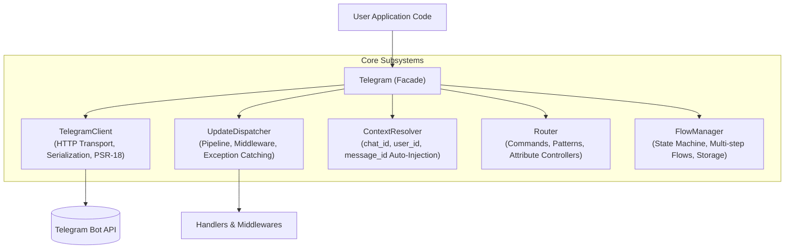

# Telegram Client Facade

The `Tueen\Telegram\Telegram` class is the central entry point and developer-facing facade of the `tueen/telegram` library. Designed around the **Composition Facade Pattern**, it unifies all underlying subsystems — pure Bot API network requests, update dispatching, conversational state machines, attribute routing, and contextual parameter resolution — into an elegant, fluent, and strictly typed interface.

---

## 🏛️ 1. Architecture: The Composition Facade

Rather than functioning as a monolithic "God Object", the `Telegram` class acts as a high-level orchestrator. It holds references to specialized, single-responsibility components and delegates operations to them:



### Why this design matters:
* **Separation of Concerns (SRP):** Each subsystem is completely decoupled, individually testable, and reusable in isolation (e.g. using `TelegramClient` directly in pure HTTP microservices or worker jobs).
* **Zero Concurrency Hazards:** State is scoped cleanly; the facade uses `ContextResolver` to ensure updates and contextual parameters never leak across concurrent requests or asynchronous event loops.
* **Ergonomic Developer Experience (DX):** You interact with a single intuitive `$bot` object without having to wire up five disparate classes manually.

---

## 🧭 2. Complete Method Catalog

Below is the comprehensive catalog of all methods provided on the `Telegram` class, grouped by responsibility.

### A. Initialization & Testing Factory

| Method | Return Type | Description |
| :--- | :--- | :--- |
| `Telegram::create(string $token)` | `ConfigBuilder` | Creates a fluent configuration builder for advanced setup (timeouts, proxy, retries, etc.). |
| `Telegram::fake(array $responses = [], ...)` | `TelegramFake` | Creates an in-memory testing fake client with assertion helpers (`assertSent`, `assertSentCount`). |
| `new Telegram(string\|Config $tokenOrConfig)` | `Telegram` | Instantiates the facade directly using a bot token string or an immutable `Config` object. |
| `getConfig()` | `Config` | Returns the immutable configuration instance driving the bot. |

### B. Execution & Running Modes

| Method | Return Type | Description |
| :--- | :--- | :--- |
| `run(mixed ...$handlers)` | `mixed` | Executes the bot using the configured running mode (WebhookMode or PollingMode). |
| `autoRun(mixed ...$handlers)` | `mixed` | Adaptive runner: automatically selects `PollingMode` in CLI and `WebhookMode` under HTTP servers. |
| `useAutoMode(...)` | `static` | Configures adaptive `AutoMode` with custom fallback parameters and webhook cleanup flags. |
| `setRunningMode(RunningModeInterface $mode)` | `static` | Sets an explicit running mode instance (e.g. `new WebhookMode()` or `new PollingMode()`). |
| `getRunningMode()` | `RunningModeInterface` | Retrieves the active running mode (defaults to `WebhookMode`). |
| `poll(int $timeout = 30, int $limit = 100, ?array $allowedUpdates = null)` | `Generator<int, Update>` | Returns a lazy PHP generator yielding incoming updates via long-polling. |

### C. Update Pipeline & Middleware

| Method | Canonical / Alias | Description |
| :--- | :--- | :--- |
| `middleware(callable $middleware)` | **Canonical** | Appends a global middleware into the incoming update dispatch pipeline. |
| `use(callable $middleware)` | *Alias* | Shorthand alias for `middleware()`, matching Telegraf and grammY conventions. |
| `pipe(MiddlewareInterface\|Closure $middleware)` | **Canonical** | Appends an outbound HTTP middleware into the client request pipeline (e.g. Retry, RateLimit). |
| `onBeforeRequest(callable $callback)` | **Hook** | Lifecycle hook executed before every outbound HTTP request to Telegram. |
| `onAfterRequest(callable $callback)` | **Hook** | Lifecycle hook executed after receiving the raw HTTP response. |
| `onError(callable $callback)` | **Hook** | Lifecycle hook executed when an HTTP or network exception occurs. |
| `onResponse(callable $callback)` | **Hook** | Lifecycle hook executed when a final parsed response (`Type` or `Error`) is produced. |

### D. Exception & Error Handling

| Method | Canonical / Alias | Description |
| :--- | :--- | :--- |
| `catch(string\|callable $exceptionOrHandler, ?callable $handler = null)` | **Canonical** | Registers a typed exception catcher for errors thrown during update processing. |
| `onUpdateError(callable $handler)` | *Alias* | Convenience shorthand for `catch(\Throwable::class, $handler)`. |
| `handleUpdateException(\Throwable $e, Update $update)` | **Internal** | Dispatches an exception through registered catchers; returns `true` if handled. |

### E. Update Routing & Controllers

| Method | Description |
| :--- | :--- |
| `onCommand(string $command, mixed $handler)` | Matches bot commands (e.g. `/start`, `/help`) with optional argument passing. |
| `onCallbackQuery(?string $pattern, mixed $handler)` | Matches inline keyboard button callbacks, supporting regex capture groups. |
| `onMessage(?string $pattern, mixed $handler)` | Matches text messages against an optional regex pattern. |
| `onInlineQuery(?string $pattern, mixed $handler)` | Matches inline queries against an optional regex pattern. |
| `on(UpdateType\|string $type, mixed $handler)` | Matches any Telegram update type (e.g. `UpdateType::Message`, `'chat_member'`). |
| `onFallback(mixed $handler)` | Catch-all fallback handler executed when no route or active flow matches. |
| `registerController(string\|object $controller)` | Scans and registers an attribute-decorated controller class (e.g. `#[OnCommand]`). |
| `router()` | Retrieves or initializes the underlying `Router` instance. |
| `handle(mixed ...$handlers)` | Appends raw update handlers or invokable classes to the dispatcher. |
| `invokeHandler(mixed $handler, Update $update)` | Resolves dependencies and executes a single update handler. |

### F. Multi-Step Conversational Flows

| Method | Description |
| :--- | :--- |
| `flow(?int $chatId = null, ?int $userId = null)` | Retrieves a fluent `FlowSession` for interacting with the active conversation. |
| `startFlow(string $flowClass, ...)` | Initiates a multi-step conversation flow for the current chat and user. |
| `hasActiveFlow(?int $chatId = null, ?int $userId = null)` | Checks whether the chat/user currently has an unfinished flow in state storage. |
| `getActiveFlow(?int $chatId = null, ?int $userId = null)` | Instantiates and returns the active `Flow` object, or `null` if none is active. |
| `getActiveFlowClass(...)` | Returns the fully-qualified class string of the active flow. |
| `flowBack(...)` | Navigates the active conversation back one step in the history stack. |
| `cancelFlow(...)` | Cancels the active conversation and wipes state from storage. |
| `finishFlow(...)` | Marks the active conversation as successfully completed. |
| `flowManager()` | Returns the underlying `FlowManager` state orchestrator. |
| `setFlowStore(StateStoreInterface $store)` | Replaces the conversation state driver (e.g. Redis, database, or file store). |
| `setRootFlow(?string $flowClass)` | Configures a default flow to automatically launch when an idle user sends a message. |

### G. Contextual Accessors & Shortcuts

When processing updates, `Telegram` automatically infers contextual identifiers:

| Accessor Method | Inferred Source |
| :--- | :--- |
| `$bot->chatId()` | Active chat ID (`message->chat->id`, `callback_query->message->chat->id`, etc.) |
| `$bot->userId()` | Active user ID (`from->id`) |
| `$bot->messageId()` | Active message ID (`message->message_id`) |
| `$bot->businessConnectionId()` | Active Telegram Business connection ID |
| `$bot->messageThreadId()` | Active forum topic thread ID |
| `$bot->callbackQueryId()` | Active callback query ID |
| `$bot->inlineQueryId()` | Active inline query ID |
| `$bot->chat()` | Finds the primary `Chat` object from the current update |
| `$bot->user()` | Finds the primary `User` object from the current update |
| `$bot->message()` | Finds the primary `Message` object from the current update |
| `$bot->reply($text, ...$args)` | Direct shortcut to send a text message to the active chat in context |
| `$bot->bindDefault($param, $resolver)` | Binds a custom contextual resolver for any method parameter |

### H. Bot API Method Calls & File Operations

| Method | Description |
| :--- | :--- |
| `$bot->sendMessage(...)` *(dynamic)* | All 185 Telegram Bot API methods are callable directly via camelCase named arguments. |
| `send(Method $method, ...)` | Executes an explicit `Method` class object with optional progress callbacks. |
| `downloadFile($file, $destination, ...)` | Downloads a file (by `file_id` or `File` object) with download progress tracking. |
| `parseUpdate(string\|array $payload)` | Parses raw webhook JSON or array payload into a typed `Update` object. |

---

## ⚖️ 3. Canonical Methods vs. Aliases: Design Philosophy

`tueen/telegram` intentionally maintains a small, carefully curated set of method aliases on the `Telegram` facade:

```
┌─────────────────────────────────┬─────────────────────────────────┬────────────────────────────────┐
│ Canonical Method                │ Shorthand / DX Alias            │ Rationale                      │
├─────────────────────────────────┼─────────────────────────────────┼────────────────────────────────┤
│ $bot->middleware($callable)     │ $bot->use($callable)            │ Node.js (Telegraf/grammY) DX   │
│ $bot->catch($class, $handler)   │ $bot->onUpdateError($handler)   │ Expressive Catch-All shortcut  │
│ Telegram::BOT_API_VERSION       │ Telegram::API_VERSION           │ Version constant brevity       │
│ $keyboard->callback($txt, $act) │ $keyboard->action($txt, $act)   │ Intuitive action nomenclature  │
└─────────────────────────────────┴─────────────────────────────────┴────────────────────────────────┘
```

### Why Keep Aliases?
1. **Developer Intuition:** Developers transitioning from Node.js or Kotlin frameworks instinctively reach for `$bot->use()`. PHP developers adhering to PSR-15 look for `$bot->middleware()`. Supporting both reduces cognitive friction.
2. **Readability in Method Chaining:** In short Fluent pipelines, `$bot->use($auth)->catch($onError)->run()` reads like natural English.
3. **Zero Overhead:** Every alias is implemented as a direct one-line forwarder to the canonical method with strict type hints and `@see` documentation for IDE autocomplete clarity.

---

## 🔌 4. Accessing Underlying Subsystems

If you need advanced control or want to interact directly with internal subsystems without going through the facade:

```php
use Tueen\Telegram\Telegram;

$bot = new Telegram('YOUR_BOT_TOKEN');

// 1. Pure Bot API HTTP client (bypasses update processing):
$client = $bot->getClient();
$me = $client->getMe();

// 2. Raw Update Dispatcher:
$dispatcher = $bot->getDispatcher();

// 3. Update Router:
$router = $bot->router();

// 4. Flow State Orchestrator:
$flowManager = $bot->flowManager();

// 5. Context Parameter Resolver:
$context = $bot->context();
```

---

## 💡 5. Recommended Best Practices

* **Always use named arguments:** When calling Bot API methods through the facade (e.g. `$bot->sendMessage(text: '...')`), named arguments enable automatic contextual injection of `chatId`.
* **Inject `$bot` or `$context` into handlers:** Inside route closures or controller actions, type-hint `Telegram $bot` and `Update $update` for instant access to facade helpers.
* **Keep Controllers Thin:** Use the facade to route requests to dedicated controller classes (`$bot->registerController(OrderController::class)`) rather than packing entire bots into a single file.
